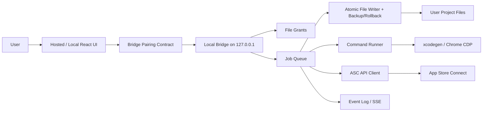

# iOS Release Assistant 로컬 브리지 / 온라인 UI 경계 PRD

**Date**: 2026-06-10  
**Category**: app  
**Slug**: ios-release-assistant-bridge-prd  
**Scope**: `/Users/pomfs_agent/POMFS/POMFS-iOS-App/ios-release-assistant/server`, `/Users/pomfs_agent/POMFS/POMFS-iOS-App/ios-release-assistant/src/api`

## Summary

iOS Release Assistant는 "초보자용 안내 UI"와 "사용자의 Mac 파일시스템, 로컬 명령, App Store Connect 변경"이 같은 브라우저 흐름에서 만나는 도구다. 글로벌 서비스 수준의 안전 경계는 다음 원칙으로 고정해야 한다.

- 온라인 UI는 안내자/계획자이며, 로컬 파일시스템과 ASC private key를 소유하지 않는다.
- 로컬 브리지는 권한 보유 실행자이며, pairing, 파일 grant, one-time approval, 작업 큐, 백업/롤백, 이벤트 로그를 강제한다.
- CORS는 인증 수단이 아니다. Origin, Fetch Metadata, pairing token, CSRF token, plan hash, one-time approval이 각각 다른 방어층이어야 한다.
- "초보자용 도구" 단계는 읽기/계획까지이고, 실제 파일 변경/명령 실행/ASC mutation은 별도 고위험 실행 단계로 분리한다.

현재 구현은 이미 loopback 바인딩, pairing token, capability metadata, secret redaction, 백업 후 쓰기, ASC API 연동을 갖췄다. 그러나 현 상태를 온라인 UI와 연결 가능한 제품으로 확장하면 pairing 발급, hardcoded confirmation token, legacy unpaired scan endpoint, unscoped filesystem/media path, 순차 ASC mutation, 비원자 파일 쓰기, 작업 큐 부재가 P0/P1 출시 차단 리스크다.

이 PRD는 해당 P0/P1을 구현 전 차단 게이트와 수용 기준으로 닫는다. 코드 수정은 수행하지 않았다.

## Findings

### P0/P1 리스크와 제거 요구사항

| ID | 심각도 | 파일 근거 | 현재 리스크 | PRD 제거 요구사항 |
| --- | --- | --- | --- | --- |
| R-01 | P0 | `server/local-server.mjs:143-155`, `server/bridge/policy.mjs:180-229`, `src/api/bridge.ts:84-107` | `/api/bridge/pair`가 사용자 확인 없이 bearer token을 발급한다. 정책은 allowlist 외 loopback origin도 허용하고, 클라이언트는 자동 pairing 후 모든 POST에 token을 붙인다. 같은 Mac의 임의 localhost origin 또는 로컬 악성 프로세스가 pairing을 얻으면 파일/ASC mutation까지 이어질 수 있다. | Pairing은 bridge-local consent가 있는 challenge-response여야 한다. 토큰은 origin, session public key, capability, file grant, TTL에 바인딩하고 `/pair`는 token을 즉시 반환하지 않는다. |
| R-02 | P0 | `src/api/bridge.ts:21-27`, `server/writePlan.mjs:417-420`, `server/appStoreConnect.mjs:1024-1027`, `server/appStoreConnect.mjs:1136-1138`, `server/appStoreConnect.mjs:1073-1076` | confirmation token이 클라이언트 상수 또는 plan 응답에 노출된다. 현재 confirmation은 사용자 승인 증거가 아니라 paired caller가 재사용 가능한 문자열이다. | 모든 mutation approval은 bridge가 생성한 one-time approval이어야 한다. approval은 action, plan hash, current file hash 또는 ASC resource version, origin, session, 만료시간에 바인딩한다. |
| R-03 | P0 | `server/local-server.mjs:589-602`, `src/api/scanFolder.ts:5-13`, `server/scanFolder.mjs:687-710` | legacy `/api/scan-folder`가 `/api/bridge/*` 정책 밖에서 pairing 없이 경로 스캔을 수행한다. `scanFolder` 자체도 root allowlist/grant를 받지 않는다. | public endpoint는 health만 허용한다. 모든 project-data endpoint는 `/api/bridge/v1/*` 아래로 통합하고 pairing + file grant를 요구한다. legacy endpoint는 제거 또는 410으로 닫는다. |
| R-04 | P0 | `server/folderBrowser.mjs:54-67`, `server/scanFolder.mjs:687-790`, `server/appStoreConnect.mjs:561-576`, `server/appStoreConnect.mjs:1248-1258` | folder browser만 root 제한이 있고, scan/media upload는 caller가 준 임의 경로를 읽는다. paired origin이 임의 로컬 파일을 App Store Connect upload operation으로 전송할 수 있다. | 파일 접근은 Finder 선택 또는 explicit path 입력 승인으로 생성된 grant ID만 허용한다. scan/write/media upload는 모두 `realpath` 기반 grant boundary를 통과해야 하며 symlink escape를 거부한다. |
| R-05 | P0 | `server/appStoreConnect.mjs:1430-1451`, `server/appStoreConnect.mjs:1454-1489`, `server/appStoreConnect.mjs:1492-1530` | ASC draft update, media upload, review submit이 순차 실행되고 중간 실패 시 외부 상태가 부분 변경된다. re-read precondition, idempotency ledger, compensation plan이 없다. | ASC mutation은 durable job으로 실행하고, 실행 직전 ASC state를 다시 읽어 plan hash/resource state가 일치할 때만 실행한다. 부분 성공은 job event와 compensation/manual rollback plan을 남긴다. review submit은 별도 최고위험 approval gate다. |
| R-06 | P0 | `server/generateProject.mjs:108-123`, `server/generateProject.mjs:126-139`, `server/scanFolder.mjs:493-560` | `xcodegen` 실행은 사용자 프로젝트 cwd와 process env를 그대로 받는다. command approval이 hardcoded token에 의존하고, 실패/부분 overwrite 후 자동 rollback이 없다. scan preview도 headless Chrome/CDP를 spawn한다. | 명령 실행은 allowlisted absolute binary, sanitized env, process group kill, timeout, output cap, job log redaction, pre/post snapshot, rollback gate를 가져야 한다. command execution은 파일 grant와 별도 command grant가 필요하다. |
| R-07 | P1 | `server/writePlan.mjs:510-546`, `server/appStoreConnect.mjs:615-618`, `server/local-server.mjs:288-353` | plan/session/job이 in-memory Map이고 root별 mutex/queue가 없다. 사용자가 더블클릭하거나 여러 탭이 동시에 호출하면 write/generate/ASC mutation이 경합한다. | root별 단일 writer queue와 ASC session별 mutation queue를 도입한다. 모든 mutation은 idempotency key와 job state machine을 통해 실행한다. |
| R-08 | P1 | `server/writePlan.mjs:269-306`, `server/writePlan.mjs:425-507`, `server/generateProject.mjs:51-89` | YAML은 target에 직접 `writeFile`, plist는 `plutil -o filePath` 직접 출력이다. 백업은 있지만 apply 실패 시 자동 restore가 없다. | 같은 디렉터리 temp file + fsync + atomic rename으로 쓰고, pre-image hash 불일치 시 중단한다. verification 실패 또는 중간 예외 시 backup manifest로 자동 rollback을 시도한다. |
| R-09 | P1 | `server/bridge/capabilities.mjs:3-109`, `server/local-server.mjs:447-516` | capability manifest는 media upload/review submit endpoints를 누락하고 있다. UI가 bridge capability를 신뢰하면 실제 surface와 정책 문서가 어긋난다. | capability manifest는 executable route table에서 생성하거나 테스트로 parity를 강제한다. UI는 capability에 없는 endpoint 호출을 금지한다. |
| R-10 | P1 | `src/api/bridge.ts:93-224`, `src/api/scanFolder.ts:5-13`, `server/local-server.mjs:627-655` | 온라인 hosted UI가 local bridge를 발견/검증/권한 요청하는 transport contract가 없다. 현재 bridge client는 relative path 중심이고, scan fallback은 localhost 개발 상황만 고려한다. | hosted UI bridge discovery는 explicit port input, signed bridge descriptor, Local Network Access/secure-context fallback, local-only UI fallback을 포함한다. |
| R-11 | P1 | `server/local-server.mjs:43-50`, `server/generateProject.mjs:40-43`, `server/appStoreConnect.mjs:530-539` | response redaction은 있으나 structured audit log/event stream이 없다. 사용자가 긴 작업 진행/실패 원인/rollback 상태를 추적할 수 없다. | 모든 job은 append-only JSONL event log와 SSE/WebSocket stream을 가진다. event는 sequence, jobId, redacted message, current phase, recoverability를 포함한다. |
| R-12 | P1 | `npm test` 실행 결과 | 최초 실행에서는 39개 중 36개 통과, 3개 실패였으나 2026-06-10 재검증에서 39개 모두 통과했다. 현재 테스트 통과는 유지 게이트이며, bridge v1 P0/P1 보안/권한 테스트는 아직 추가되어야 한다. | PRD 구현 착수 전 현재 테스트를 계속 녹색으로 유지하고, bridge v1의 origin/CSRF/file grant/one-time approval/idempotency 테스트를 추가한다. |

## Evidence

- `README.md:11-15`, `README.md:22-23` - 제품 방향이 로컬 설치판, 온라인 버전, ASC API, 파일/백업/xcodegen을 모두 포함함을 확인했다.
- `docs/product-plan.md:116-138` - 브라우저 단독 한계와 로컬 설치판/온라인판 분리 필요가 기존 제품 계획에 이미 정의되어 있다.
- `docs/product-plan.md:237-246` - Apple ID password 금지, API Key 세션 처리, 최소 권한 안내가 기존 보안 원칙이다.
- `server/local-server.mjs:21-35` - 기본 host는 loopback으로 제한된다.
- `server/bridge/policy.mjs:223-239` - Origin이 없으면 허용되고, allowlist 외 loopback origin도 허용된다.
- `server/bridge/pairing.mjs:3-45` - pairing token은 30분 TTL in-memory bearer token이다.
- `server/local-server.mjs:143-155` - pair endpoint가 token을 즉시 반환한다.
- `src/api/bridge.ts:21-27`, `src/api/bridge.ts:145-224` - mutation confirmation token이 클라이언트 상수로 고정되어 있다.
- `server/writePlan.mjs:425-507` - backup 후 apply와 rescan verification은 있으나 rollback endpoint/자동 restore가 없다.
- `server/generateProject.mjs:108-123` - xcodegen 실행은 env와 cwd를 받아 외부 command를 실행한다.
- `server/appStoreConnect.mjs:1339-1530` - ASC connect, update, media upload, review submit이 구현되어 있다.
- `server/bridge/bridgeApi.test.mjs:69-109` - 현재 테스트가 health/pair/loopback CORS를 검증한다.
- `npm test` - 2026-06-10 재검증 기준 39개 테스트 모두 통과.

## Problem Statement

현재 구조는 "개발용 localhost 앱"으로는 빠르게 동작하지만, 온라인 UI와 로컬 브리지를 연결하는 글로벌 제품으로는 보안 경계가 섞여 있다. 가장 큰 문제는 pairing token을 얻는 행위와 실제 mutation 승인 행위가 구분되지 않는다는 점이다. paired caller는 plan 생성, 백업, 파일 적용, xcodegen, ASC update/upload/submit까지 같은 bearer token과 공개 confirmation 문자열로 이어갈 수 있다.

두 번째 문제는 파일 접근 경계가 endpoint별로 다르다는 점이다. folder browser는 root 제한이 있지만 scan, write plan, ASC media upload는 별도 file grant model 없이 raw path를 받는다. 온라인 UI가 bridge에 붙는 순간 이 차이는 local file exfiltration과 의도하지 않은 ASC upload로 이어질 수 있다.

세 번째 문제는 긴 작업의 실행 모델이 request/response에 머물러 있다는 점이다. 파일 쓰기, xcodegen, ASC asset upload, review submit은 사용자에게 되돌리기 비용이 큰 작업인데도 durable job, lock, event stream, idempotency, rollback/compensation model이 없다.

## Goals

- 온라인 UI, 로컬 브리지, 사용자의 Mac 파일시스템, App Store Connect API 사이의 권한 경계를 명확히 분리한다.
- pairing, CSRF/CORS, origin pinning, file grants, one-time approval을 각각 독립 방어층으로 설계한다.
- 실제 변경 작업을 job queue로 실행하고, 순서/중복/재시도/취소/롤백을 관찰 가능하게 만든다.
- 초보자용 안내/계획 단계와 실제 파일/ASC 변경 단계를 UI와 API contract 양쪽에서 분리한다.
- PRD 수용 기준을 P0/P1 리스크 제거 게이트로 정의한다.

## Non-Goals

- 이번 PRD는 제품 코드 수정, 테스트 수정, 배포를 수행하지 않는다.
- Apple ID/password 입력 방식은 지원하지 않는다.
- 온라인 서버가 사용자의 전체 앱 소스, ASC private key, local command execution 권한을 소유하는 구조는 채택하지 않는다.
- 모든 ASC 기능 자동화를 MVP 범위로 확장하지 않는다. API가 안전하게 모델링되지 않은 항목은 manual task로 둔다.

## System Invariants

1. Hosted UI is untrusted. 온라인 UI는 사용자가 보는 안내/계획 surface일 뿐, 로컬 권한의 신뢰 주체가 아니다.
2. Local bridge is the privileged executor. 파일 읽기/쓰기, Finder 선택, xcodegen, ASC JWT signing은 로컬 브리지에서만 실행한다.
3. CORS is not auth. CORS는 브라우저 읽기 정책이고, bridge authorization을 대체하지 않는다.
4. Pairing is not mutation approval. Pairing은 세션 연결이고, 실제 변경은 별도 one-time approval이 필요하다.
5. Raw path is not a permission. 모든 file path는 grant ID와 `realpath` boundary 검사를 통과해야 한다.
6. No write without backup and rollback plan. 로컬 파일 mutation은 백업, atomic write, verification, rollback plan 없이는 실행할 수 없다.
7. No external mutation without fresh precondition. ASC mutation은 실행 직전 remote state를 다시 읽고 plan hash/resource precondition을 검증한다.
8. No silent long-running work. 긴 작업은 job state, event stream, redacted log, cancellation/timeout policy를 가져야 한다.
9. Beginner mode never executes hidden side effects. 초보자용 UI는 side effect가 있는 순간을 명확히 별도 단계로 보여줘야 한다.
10. Secrets are memory-only and redacted. ASC private key, JWT, bearer token, demo password는 저장/로그/문서/스크린샷에 남기지 않는다.

## Target Architecture



### Recommended Option

Adopt a local-first bridge model:

- Hosted UI can be served online, but privileged operations happen only through a paired loopback bridge.
- The bridge exposes a versioned API under `/api/bridge/v1/*`.
- The bridge owns all local grants, approvals, jobs, logs, backups, ASC sessions, and command execution.
- The hosted UI receives redacted status, plans, and job events only.
- If browser Local Network Access or mixed-content policy blocks hosted UI to loopback calls, the product falls back to local-served UI at the bridge origin.

### Rejected Shortcuts

- "Allow all localhost origins because it is local" is rejected. Multiple local origins can be attacker-controlled.
- "Hardcoded confirmation token is enough because the user clicked a button" is rejected. It is not an approval proof.
- "CORS allowlist is auth" is rejected. A local process and same-origin compromise bypass the intended user consent boundary.
- "Add rollback later" is rejected for file writes and xcodegen. Backup without restore is not an operational safety model.
- "Run ASC mutation in request/response and show error" is rejected. External mutation needs job state, idempotency, and compensation.

## Transport / Auth / Origin / CSRF / CORS Requirements

### TA-01: Bridge Origin Model

Requirement:

- Production bridge binds to `127.0.0.1` by default and never to `0.0.0.0`.
- Default port should be random high port or user-visible fixed port with collision handling.
- Allowed origins are exact origins from a bridge-local config plus the active paired origin. "Any loopback origin" is not accepted for mutation or project-data endpoints.
- Requests with missing `Origin` are allowed only for explicitly marked CLI/native local endpoints, not browser API endpoints.

Acceptance criteria:

- A test from `Origin: http://localhost:<random-unpaired-port>` cannot call `/pair`, project-data, or mutation endpoints.
- A test with no `Origin` cannot call browser mutation endpoints.
- `Access-Control-Allow-Origin` is never `*` for bridge endpoints.
- Preflight response for an unpaired origin returns 403 and no mutation-capable headers.

### TA-02: User-Mediated Pairing

Requirement:

- Pairing is a challenge-response flow:
  1. UI creates a client nonce and optional WebCrypto public key.
  2. Bridge creates a short code shown only in local bridge UI/CLI/native notification.
  3. User enters or confirms the code.
  4. Bridge returns a session token scoped to origin, client key, capabilities, TTL, and file grants.
- Pairing token TTL defaults to 10 minutes idle / 30 minutes absolute, with explicit revoke.
- `/pair` cannot rotate a token silently without local user consent.

Acceptance criteria:

- Automated browser POST to `/pair` without the displayed code receives 401/403.
- Reusing a token from a different Origin receives 401.
- Expired/revoked token receives 401 and cannot be refreshed without a new user-mediated challenge.
- Pairing response redacts secrets and never returns filesystem inventory.

### TA-03: CSRF Defense

Requirement:

- Bridge browser endpoints require `Content-Type: application/json`, `Authorization: Bearer`, `X-Bridge-CSRF`, `X-Bridge-Session`, `X-Bridge-Request-Id`, and Origin validation.
- `Sec-Fetch-Site: cross-site` is rejected for bridge browser endpoints.
- Token in JSON body is not accepted for browser requests.
- Pairing and mutation endpoints reject simple form POSTs.

Acceptance criteria:

- HTML form POST cannot create/rotate pairing or trigger mutation.
- Cross-site fetch with preflight cannot pass without origin-pinned token and CSRF header.
- Body-provided token fallback is removed or restricted to non-browser test adapter.

### TA-04: Hosted UI Transport

Requirement:

- Hosted UI detects whether loopback bridge access is possible under browser policy.
- If direct loopback is blocked, UI presents local-served bridge URL fallback rather than weakening CORS.
- Bridge descriptor includes version, port, capabilities, pairing URL, fingerprint, and expiry. Descriptor is not a secret.

Acceptance criteria:

- Hosted HTTPS UI can show "bridge unavailable / use local UI" without attempting unsafe fallback.
- No product path requires uploading local source code to the hosted server for MVP.
- No hosted server endpoint receives ASC private key material.

## Domain Model

```ts
type BridgeSession = {
  id: string;
  origin: string;
  issuedAt: string;
  expiresAt: string;
  capabilities: string[];
  csrfTokenHash: string;
  clientKeyThumbprint?: string;
  revokedAt?: string | null;
};

type FileGrant = {
  id: string;
  sessionId: string;
  kind: "project-root" | "project-spec" | "media-file";
  realPath: string;
  displayPath: string;
  createdBy: "finder" | "typed-path";
  expiresAt: string;
};

type ExecutionPlan = {
  id: string;
  sessionId: string;
  kind: "file-write" | "generate" | "asc-update" | "asc-media-upload" | "asc-review-submit";
  planHash: string;
  preconditions: Array<{ target: string; hash?: string; state?: string }>;
  operations: unknown[];
  createdAt: string;
};

type OneTimeApproval = {
  id: string;
  planId: string;
  action: string;
  planHash: string;
  sessionId: string;
  origin: string;
  expiresAt: string;
  consumedAt?: string | null;
};

type BridgeJob = {
  id: string;
  planId: string;
  type: ExecutionPlan["kind"];
  state: "queued" | "running" | "succeeded" | "failed" | "rolled_back" | "cancelled";
  idempotencyKey: string;
  rootGrantId?: string;
  createdAt: string;
  startedAt?: string;
  finishedAt?: string;
};
```

## API / Event Contracts

### Public

- `GET /api/bridge/v1/health` - bridge version, minimal capability, paired false/true, no project data.
- `GET /api/bridge/v1/descriptor` - non-secret descriptor for local UI or manual bridge connection.

### Pairing

- `POST /api/bridge/v1/pair/challenge` - creates local challenge, no token returned.
- `POST /api/bridge/v1/pair/complete` - requires challenge code, Origin, CSRF seed; returns scoped session.
- `POST /api/bridge/v1/pair/revoke` - revokes current session.

### Grants

- `POST /api/bridge/v1/grants/folder-picker`
- `POST /api/bridge/v1/grants/project-spec-picker`
- `POST /api/bridge/v1/grants/media-picker`
- `POST /api/bridge/v1/grants/typed-path`

All grant endpoints require paired session and return grant IDs. Raw absolute paths can be displayed to the user but cannot be accepted as authority in later mutation endpoints.

### Planning

- `POST /api/bridge/v1/plans/file-write`
- `POST /api/bridge/v1/plans/generate`
- `POST /api/bridge/v1/plans/asc-update`
- `POST /api/bridge/v1/plans/asc-media-upload`
- `POST /api/bridge/v1/plans/asc-review-submit`

Planning endpoints are read-only except for in-memory/durable plan ledger writes. They return plan hash, operation list, manual tasks, required approvals, expected preconditions, and risk classification.

### Approval / Jobs

- `POST /api/bridge/v1/approvals` - creates one-time approval after local/user confirmation.
- `POST /api/bridge/v1/jobs` - consumes approval and queues execution.
- `GET /api/bridge/v1/jobs/:id`
- `GET /api/bridge/v1/events?jobId=...&after=...` - SSE or long-poll fallback.
- `POST /api/bridge/v1/jobs/:id/cancel`
- `POST /api/bridge/v1/jobs/:id/rollback` - only for rollback-capable local jobs.

## Work Queue / Atomic Writes / Backup / Rollback / Command Isolation

### Q-01: Job Queue

Requirement:

- Per project root grant, at most one mutation job runs at a time.
- Per ASC session/app/version, at most one mutation job runs at a time.
- Read-only scan jobs may run concurrently but must snapshot inputs and cannot observe half-written output.
- Every mutation has an idempotency key and plan hash.

Acceptance criteria:

- Two simultaneous apply requests for the same plan result in one running job and one idempotent replay or 409 duplicate response.
- Generate cannot start while file apply for the same root is running.
- ASC submit cannot start while ASC media upload/update is running for the same app/version.

### W-01: Atomic File Writes

Requirement:

- Before apply, verify every target's current hash matches the plan precondition.
- Write temp file in the same directory, preserve mode where applicable, flush file and parent directory, then rename.
- `plutil` writes to temp output first, then atomic rename to target.
- YAML writer must preserve unrelated data as much as the parser/writer allows and never update unplanned keys.

Acceptance criteria:

- If a target file changes after plan creation, apply is blocked before writing.
- Killing the process during write leaves either the old file or the new verified file, not a truncated target.
- Verification failure triggers rollback attempt and job state records recoverability.

### B-01: Backup and Rollback

Requirement:

- Backup manifest includes tool version, plan hash, root grant, target hashes, original relative paths, backup paths, and redacted user-visible summary.
- Rollback restores exact backed-up bytes for files modified by the failed job.
- Generate backup includes `.xcodeproj`, `.xcworkspace`, `project.yml`, and generated output inventory.

Acceptance criteria:

- Apply without backup is impossible.
- Backup missing any planned target blocks apply.
- Failed apply invokes rollback automatically unless rollback would overwrite user edits made after failure; that case becomes manual recovery with clear paths.
- UI shows "restored", "manual restore required", or "no changes applied" with job evidence.

### C-01: Command Runner

Requirement:

- Production command execution uses allowlisted absolute executable paths. Environment override such as `XCODEGEN_BIN` is development-only.
- Environment is minimal and redacted; ASC secrets/JWTs are never inherited.
- Timeout kills the process group and marks job recoverability.
- Logs are size-capped, streamed as redacted events, and stored in job log.
- Command approval displays command, cwd, affected files, backup ID, and overwrite risk.

Acceptance criteria:

- Unknown binary path cannot execute.
- Command output containing token/private-key-shaped data is redacted before event/log/result.
- Timeout leaves a failed job with rollback/manual restore state.
- Generate requires a separate approval even if file apply already succeeded.

## App Store Connect Boundary

### ASC-01: Credential and JWT Handling

Requirement:

- ASC private key is accepted only by local bridge unless a separate explicit online credential decision is approved.
- Private key is parsed into memory and raw input is immediately discarded.
- JWT is generated per request with short TTL and never logged/returned.
- Session can be disconnected; disconnect clears credentials and plan ledgers.

Acceptance criteria:

- Searching logs/events/results for `BEGIN PRIVATE KEY`, JWT-like bearer token, or demo password returns no match.
- Online hosted server receives no ASC credential body in MVP.
- Reconnect rotates session ID and invalidates old ASC plans.

### ASC-02: Read / Plan / Mutate Split

Requirement:

- ASC read may fetch app/version/localization/review detail state.
- ASC plan stores resource IDs, proposed changes, current values, appStoreState, createdAt, and plan hash.
- ASC mutate re-fetches relevant state immediately before execution and blocks if resource state differs.
- Metadata update, media upload, and review submit are separate plans/jobs/approvals.

Acceptance criteria:

- If App Store state changes between plan and apply, apply returns blocked with fresh diff.
- A media upload partial failure records which assets were reserved, uploaded, committed, and what manual cleanup is required.
- Review submit is never chained automatically after update/upload.

### ASC-03: Review Submission High-Risk Gate

Requirement:

- Review submit requires a high-risk confirmation screen with app, platform/version, selected build state, metadata completeness, unresolved manual tasks, and "not Apple official tool" disclosure.
- If any required metadata/build state cannot be verified, submit plan is blocked.

Acceptance criteria:

- Submit job cannot run from a stale plan.
- Submit job cannot run when manual blocking tasks exist.
- Existing submission detection is explicit; creating a new submission is separately logged.

## Beginner Tool vs Real Changes

| Stage | User-facing mode | Allowed side effects | Required acceptance criteria |
| --- | --- | --- | --- |
| 0 | Learn / Checklist | None | Works without bridge, file access, ASC credentials, or upload. All output is educational/manual. |
| 1 | Local Read Grant | Finder/typed path prompt only | User sees selected root/path and grants read-only access. No write/generate/ASC mutation endpoints enabled. |
| 2 | Scan / Plan | Read local files under grant; read ASC only after connect | UI labels this as "검토/계획". Plans show exact files/endpoints/commands and manual tasks. |
| 3 | Backup | Copy planned target files to backup dir | Backup approval is one-time, plan-hash-bound, and shows backup location. Apply remains disabled until backup succeeds. |
| 4 | File Apply | Atomic local file writes only | Separate approval, precondition hash check, rollback on failure, post-scan verification. |
| 5 | Generate | Run allowlisted xcodegen | Separate command approval, backup of generated outputs, command event stream, timeout/rollback/manual recovery state. |
| 6 | ASC Draft Update / Media Upload | ASC metadata/media mutation | Separate ASC approval, fresh remote state check, idempotency, partial failure compensation. |
| 7 | ASC Review Submit | Create/use App Store review submission | Highest-risk gate. Requires verified build/metadata/manual-task status and separate approval from all previous ASC jobs. |

## Observability / SLOs

### Required Events

Every job emits ordered events:

- `job.created`
- `approval.consumed`
- `precondition.checked`
- `backup.started`
- `backup.completed`
- `write.started`
- `write.file.completed`
- `command.started`
- `command.output`
- `asc.request.started`
- `asc.request.completed`
- `verification.completed`
- `rollback.started`
- `rollback.completed`
- `job.succeeded`
- `job.failed`

### Local SLOs

- Bridge startup p95 under 3 seconds on supported macOS developer machines.
- Health endpoint p95 under 100 ms.
- Pairing challenge completion p95 under 30 seconds after user enters code.
- Scan p95 under 10 seconds for a normal app folder under documented file limits.
- Mutation job event delay p95 under 500 ms while the bridge process is healthy.
- Secret redaction test suite must pass 100%.

### No-Go Metrics

- Any unpaired project-data or mutation endpoint: release blocked.
- Any mutation endpoint accepting hardcoded/static confirmation token: release blocked.
- Any local write path without backup + precondition + atomic rename: release blocked.
- Any ASC mutation without fresh remote precondition check: release blocked.
- Any test fixture or log containing ASC private key/JWT/demo password: release blocked.

## Migration Plan

1. Policy freeze: mark current bridge API as dev-only and block online UI connection until v1 security contract exists.
2. Endpoint consolidation: remove or 410 legacy `/api/scan-folder`; route all project-data operations through `/api/bridge/v1`.
3. Pairing v1: implement challenge-response, origin pinning, CSRF headers, token revocation, and tests.
4. File grant v1: introduce grant IDs for selected folders/specs/media files; migrate scan/write/upload APIs to grants.
5. Job queue v1: introduce job ledger, root/ASC locks, idempotency, event stream, redacted JSONL logs.
6. Safe write v1: add precondition hashes, atomic write, backup manifest schema, rollback execution.
7. Command runner v1: add allowlisted executable discovery, minimal env, process group timeout, command event stream.
8. ASC v1: split read/plan/mutate/submit, add fresh state checks, compensation records, high-risk submit gate.
9. Capability parity: generate capabilities from route/policy registry and enforce UI calls against it.
10. Online bridge UX: implement hosted UI discovery/fallback and local-served UI fallback.

## Testing Requirements

### Security Tests

- Unpaired origin cannot call project-data or mutation endpoints.
- Arbitrary loopback origin cannot pair without local challenge code.
- Simple form POST cannot pair or mutate.
- `Sec-Fetch-Site: cross-site` requests are rejected.
- Token replay from a different Origin is rejected.
- Body token fallback is unavailable for browser endpoints.

### Filesystem Tests

- Scan outside grant is rejected.
- Symlink escape from granted root is rejected.
- Media upload outside grant is rejected.
- File changed after plan creation blocks apply.
- Crash during atomic write does not truncate target.
- Failed verification restores backup or marks manual restore required.

### Queue / Event Tests

- Duplicate mutation request is idempotent.
- Parallel apply/generate on same root serializes.
- SSE events are ordered and resumable by sequence.
- Cancelled command kills child process group.

### ASC Tests

- ASC update blocks on stale remote state.
- Media upload partial failure records committed/uncommitted assets.
- Review submit blocks when manual tasks remain.
- JWT/private key/demo password never appears in responses, logs, or events.

### Current Test Status

Test command:

```bash
npm test
```

Initial result on 2026-06-10:

- Test files: 1 failed, 2 passed.
- Tests: 3 failed, 36 passed, 39 total.

Latest result on 2026-06-10 after current worktree revalidation:

- Test files: 3 passed.
- Tests: 39 passed, 39 total.

Build command:

```bash
npm run build
```

Result on 2026-06-10:

- Passed. `tsc --noEmit && vite build` completed successfully.

Release gate:

- No implementation PR may ship unless these tests remain passing and the additional P0/P1 gate tests in this PRD are added for bridge v1.

## Implementation WBS

| Phase | Deliverable | Exit criteria |
| --- | --- | --- |
| P0-A | Bridge policy registry v1 | One route table drives policy, capabilities, tests, and handler dispatch. |
| P0-B | Pairing/auth/CSRF v1 | User-mediated pairing, origin pinning, CSRF/Fetch Metadata tests pass. |
| P0-C | File grant v1 | All scan/write/media paths require grants and pass symlink escape tests. |
| P0-D | Approval v1 | No static confirmation tokens remain; approvals are one-time and plan-hash-bound. |
| P0-E | Job queue/event log v1 | Root/ASC locks, idempotency, ordered events, redacted logs implemented. |
| P0-F | Atomic write/rollback v1 | Precondition, atomic rename, backup/restore tests pass. |
| P0-G | Command runner hardening | Allowlisted binary, sanitized env, timeout/kill, command logs tested. |
| P0-H | ASC mutation safety | Fresh state checks, partial failure records, review submit high-risk gate tested. |
| P1-A | Hosted UI bridge discovery | Secure fallback UX works without weakening bridge CORS. |
| P1-B | Capability parity | Capability manifest includes all endpoints and fails tests on drift. |

## Open Decisions

These are not unresolved P0/P1 gaps because implementation is blocked until they are decided.

- OD-01: Distribution shape: npm local server, packaged desktop app, or signed local daemon.
- OD-02: Hosted UI bridge transport fallback: Local Network Access prompt, local-served UI, or custom URL scheme.
- OD-03: Durable ledger storage: in-memory plus JSONL, SQLite, or app support directory DB.
- OD-04: Online ASC credential policy: MVP should keep credentials local-only; any hosted credential processing requires a separate security review.
- OD-05: Command sandboxing level on macOS: minimal env/process group vs stronger sandbox profile/native helper.

## Release Gates

Implementation cannot proceed to user-facing online/local bridge release unless all gates pass:

- G-01: Public unauthenticated endpoints are limited to health/descriptor and contain no project data.
- G-02: Pairing requires local user-mediated challenge and origin pinning.
- G-03: Static confirmation tokens are removed from client, server plans, tests, and docs.
- G-04: Every local path operation uses file grants with realpath/symlink enforcement.
- G-05: Every mutation is a job with idempotency, lock, event stream, and redacted logs.
- G-06: Local writes use backup, precondition hash, atomic rename, verification, and rollback/manual recovery.
- G-07: xcodegen/Chrome command execution uses allowlist, sanitized env, timeout, and command approval.
- G-08: ASC mutations re-read remote state and have compensation/manual cleanup plans.
- G-09: Review submit is a separate high-risk approval gate.
- G-10: `npm test` and build checks pass.
- G-11: Security tests for unpaired access, CSRF, origin replay, grant escape, and secret leakage pass.

## Risks / Gaps

- Current code is not yet safe for a hosted online UI to connect to a local bridge.
- Current tests are not green; this blocks implementation release planning until reconciled.
- Apple ASC API behavior and browser Local Network Access behavior can change; implementation must verify against official docs during build.
- Rollback for ASC external mutation is necessarily compensating/manual in some cases. PRD must distinguish local automatic rollback from ASC compensation.

## Follow-Up

1. Decide whether to pause feature work until bridge policy/auth/file grants are implemented.
2. Resolve the three current test failures without weakening safety requirements.
3. Create an implementation PRD issue/WBS from the phases above.
4. Before code implementation, verify current Apple ASC endpoint details and browser Local Network Access behavior against official docs.

## References

- Apple Developer Documentation: [App Store Connect API](https://developer.apple.com/documentation/appstoreconnectapi)
- Apple Developer Documentation: [Creating API Keys for App Store Connect API](https://developer.apple.com/documentation/appstoreconnectapi/creating-api-keys-for-app-store-connect-api)
- Apple Developer Documentation: [Generating Tokens for API Requests](https://developer.apple.com/documentation/appstoreconnectapi/generating-tokens-for-api-requests)
- Apple Developer Documentation: [Uploading Assets to App Store Connect](https://developer.apple.com/documentation/appstoreconnectapi/uploading-assets-to-app-store-connect)
- Apple App Store Connect Help: [Submit an app](https://developer.apple.com/help/app-store-connect/manage-submissions-to-app-review/submit-an-app/)
- OWASP Cheat Sheet Series: [Cross-Site Request Forgery Prevention](https://cheatsheetseries.owasp.org/cheatsheets/Cross-Site_Request_Forgery_Prevention_Cheat_Sheet.html)
- MDN Web Docs: [Cross-Origin Resource Sharing](https://developer.mozilla.org/en-US/docs/Web/HTTP/Guides/CORS)
- WICG: [Local Network Access](https://wicg.github.io/local-network-access/)
