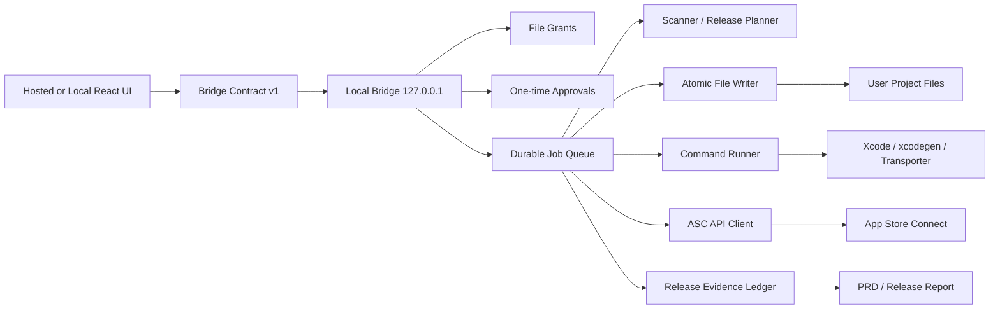

# iOS Release Assistant 종합 개선 PRD

**Date**: 2026-06-10  
**Category**: app  
**Slug**: ios-release-assistant-comprehensive-prd  
**Procedure**: goal-pomfsdev-prd-plan  
**Scope**: `/Users/pomfs_agent/POMFS/POMFS-iOS-App/ios-release-assistant` 전체, `/Users/pomfs_agent/POMFS/POMFS-iOS-App` POMFS iOS 앱 근거, App Store Connect 공식 제출 요구사항  
**Code Change**: 없음. 이 산출물은 PRD/감사 보고서이며 제품 코드는 수정하지 않았다.

## Executive Summary

iOS Release Assistant는 "초보자도 App Store 제출 준비를 따라갈 수 있는 도구"를 목표로 하지만, 현재 구현은 파일 스캔, 파일 수정, `xcodegen`, App Store Connect(ASC) 초안 수정, 미디어 업로드, 심사 제출을 개별 기능으로 제공하는 수준에 머물러 있다. 제출 가능 여부를 증명하는 release evidence chain과 보안 실행 경계가 아직 제품 모델로 닫혀 있지 않다.

가장 우선순위가 높은 개선 방향은 다음 네 가지다.

1. **Submission-ready를 UI 체크리스트가 아니라 evidence ledger 상태로 재정의한다.** ledger는 full Xcode/SDK 확인, build settings resolve, archive/export/upload, ASC build processing, build 선택, metadata/privacy/media/compliance 완료, review submission 상태를 포함해야 한다.
2. **로컬 브리지를 privileged executor로 분리한다.** hosted UI는 신뢰하지 않고, pairing, origin pinning, CSRF, file grant, one-time approval, root별/ASC별 job queue, redacted event log를 bridge가 강제해야 한다.
3. **ASC mutation을 idempotent state machine으로 바꾼다.** draft update, media upload, review submission은 같은 상태 집합이 아니라 capability별 state machine, fresh remote precondition, partial success ledger, retry/compensation plan을 가져야 한다.
4. **POMFS mode에서는 release-history 예외를 release blocker로 승격한다.** 과거 iOS 릴리즈의 `xcodebuild was not run`, `source-ready`, `requires local Xcode pull/build/install` 예외가 archive/export/upload evidence로 해소되기 전까지 "ready"를 표시하면 안 된다.

이 PRD는 P0/P1 리스크를 요구사항과 수용 기준으로 닫는다. 2026-06-10 재검증 기준 `npm test`는 39개 모두 통과했고 `npm run build`도 통과했다. 다만 active developer directory는 Command Line Tools라서 `xcodebuild -version`이 full Xcode 부재 오류로 실패한다. 따라서 이 PRD 승인 후 첫 실행 항목은 단순 테스트 복구가 아니라 release evidence blocker를 구현하고, full Xcode/archive/export/upload/build-selection 증거 없이는 ready 상태를 막는 작업이어야 한다.

## Current Evidence

### 구현 근거

- `/Users/pomfs_agent/POMFS/POMFS-iOS-App/ios-release-assistant/server/appStoreConnect.mjs:6-9` - ASC connect/update/media/review confirmation token이 상수다.
- `/Users/pomfs_agent/POMFS/POMFS-iOS-App/ios-release-assistant/server/appStoreConnect.mjs:61-68` - 하나의 `EDITABLE_APP_STORE_STATES`가 metadata, media, review submit 판단에 재사용된다.
- `/Users/pomfs_agent/POMFS/POMFS-iOS-App/ios-release-assistant/server/appStoreConnect.mjs:620-634` - ASC request wrapper는 실패를 즉시 throw하며 retry class, rate-limit handling, operation ledger가 없다.
- `/Users/pomfs_agent/POMFS/POMFS-iOS-App/ios-release-assistant/server/appStoreConnect.mjs:711-1030` - draft update plan을 만들지만 deterministic plan id, remote precondition, idempotency key가 없다.
- `/Users/pomfs_agent/POMFS/POMFS-iOS-App/ios-release-assistant/server/appStoreConnect.mjs:1050-1082` - review submit plan은 appStoreVersion 존재와 state만 확인하고 selected build/privacy/media/compliance evidence를 요구하지 않는다.
- `/Users/pomfs_agent/POMFS/POMFS-iOS-App/ios-release-assistant/server/appStoreConnect.mjs:1085-1154` - media upload plan은 파일 확장자/크기 중심이며 device pixel spec, duration/codec, poster frame, localization completeness, processing status를 gate로 삼지 않는다.
- `/Users/pomfs_agent/POMFS/POMFS-iOS-App/ios-release-assistant/server/appStoreConnect.mjs:1250-1329` - asset reservation/upload/commit은 있으나 part checksum verification, short-read 검증, processing poll, retry resume가 없다.
- `/Users/pomfs_agent/POMFS/POMFS-iOS-App/ios-release-assistant/server/appStoreConnect.mjs:1432-1533` - ASC update/upload/submit은 request/response 실행이며 partial success를 durable하게 남기지 않는다.
- `/Users/pomfs_agent/POMFS/POMFS-iOS-App/ios-release-assistant/server/scanFolder.mjs:687-824` - raw path를 받아 project.yml, Info.plist, entitlements, asset, screenshot 후보를 읽지만 file grant 모델은 없다.
- `/Users/pomfs_agent/POMFS/POMFS-iOS-App/ios-release-assistant/server/writePlan.mjs:400-547` - write plan, backup, apply, verification은 있으나 plan hash, precondition hash, atomic write, rollback 실행, durable queue가 없다.
- `/Users/pomfs_agent/POMFS/POMFS-iOS-App/ios-release-assistant/server/generateProject.mjs:92-155` - `xcodegen generate`를 실행하고 백업은 만들지만 command isolation, process group kill, rollback/manual recovery state가 부족하다.
- `/Users/pomfs_agent/POMFS/POMFS-iOS-App/ios-release-assistant/server/local-server.mjs:143-155` - `/api/bridge/pair`가 사용자 중재 challenge 없이 pairing token을 반환한다.
- `/Users/pomfs_agent/POMFS/POMFS-iOS-App/ios-release-assistant/server/local-server.mjs:369-530` - ASC connect/read/update/media/review submit route가 bridge 아래에 있지만 v1 contract, job queue, one-time approval contract는 없다.
- `/Users/pomfs_agent/POMFS/POMFS-iOS-App/ios-release-assistant/server/local-server.mjs:589-602` - legacy `/api/scan-folder`가 bridge policy 밖에서 raw path scan을 수행한다.
- `/Users/pomfs_agent/POMFS/POMFS-iOS-App/ios-release-assistant/src/types.ts:66-272` - ASC 타입은 plan/result 위주이며 retry, partial success, error class, stale state, compensation이 없다.
- `/Users/pomfs_agent/POMFS/POMFS-iOS-App/ios-release-assistant/src/types.ts:352-390` - `FolderScanResult`는 관측 결과지만 snapshot fingerprint가 없다.
- `/Users/pomfs_agent/POMFS/POMFS-iOS-App/ios-release-assistant/src/types.ts:518-599` - write/generate 상태는 UI state에 가깝고 실행 ledger가 아니다.

### POMFS 앱 근거

- `/Users/pomfs_agent/POMFS/POMFS-iOS-App/project.yml` - target `P.O.MFS`, bundle id `com.prideofmisfits.community`, `DEVELOPMENT_TEAM: ""`, marketing/build version, Mac Catalyst/device family 설정이 있다.
- `/Users/pomfs_agent/POMFS/POMFS-iOS-App/P.O.MFS/Info.plist` - microphone/location/camera permission strings, build setting placeholders, URL schemes, `NSAllowsArbitraryLoads`, background modes가 있다.
- `/Users/pomfs_agent/POMFS/POMFS-iOS-App/P.O.MFS/Entitlements/Entitlements.plist` - production APNs, associated domains, Sign in with Apple, macOS sandbox/device/network/location/file entitlements가 있다.
- `/Users/pomfs_agent/POMFS/POMFS-iOS-App/release-history/releases/2026-05-22_r1_50_1_ios_payment_webview.json` - verification이 partial이고 `xcodebuild was not run` 예외가 있다.
- `/Users/pomfs_agent/POMFS/POMFS-iOS-App/release-history/releases/2026-05-22_r1_50_3_ios_scoped_location_webview.json` - source-ready/local Xcode pull/build/install 예외가 있다.

### 공식 요구사항 근거

- Apple은 App Store Connect API 호출에 JWT authorization을 요구한다.
- Apple은 build upload가 Xcode, Swift Playground, altool, Transporter 또는 App Store Connect API 경로로 이루어지며, build가 App Store Connect에 나타나기 전 Apple processing이 필요하다고 설명한다.
- Apple은 2026-04-28 이후 업로드되는 앱이 Xcode 26 이상 및 iOS/iPadOS/tvOS/visionOS/watchOS 26 SDK 계열로 빌드되어야 한다고 공지했다.
- Apple은 App Review 제출 전에 required metadata와 target version의 build 선택을 요구하며, 각 version은 하나의 build와 연결된다.
- Apple은 screenshots를 최소 1개, 최대 10개로 제한하고 JPEG/JPG/PNG 형식을 요구한다. app previews는 디바이스 크기/언어별 최대 3개이고, app preview processing은 최대 24시간 걸릴 수 있다.
- Apple은 privacy policy URL을 모든 앱에 필수로 두며, data types, privacy choices URL, third-party SDK privacy manifest/signature, age rating, export compliance 같은 항목을 제출 readiness에 포함한다.

## P0/P1 Risk Register

| ID | Priority | Risk | Root Cause | PRD Removal Requirement |
| --- | --- | --- | --- | --- |
| P0-1 | P0 | 실제 제출 필수 체인이 없다. | scan/preflight/update/upload/submit 기능이 release evidence ledger로 묶이지 않는다. | `ReleaseEvidenceLedger`가 Xcode/SDK, build settings, archive, export, upload, build processing, selected build, metadata/privacy/media/compliance, submission state를 필수 evidence로 갖고, 하나라도 없으면 ready/submission-ready를 금지한다. |
| P0-2 | P0 | build 선택/처리 완료 없이 review submission이 가능하다. | `createReviewSubmitPlan`이 appStoreVersion state만 본다. | review submit plan은 processed build relationship, version/build string match, export compliance, required metadata, media ready, privacy/compliance matrix를 fresh ASC snapshot으로 검증한다. |
| P0-3 | P0 | local bridge mutation 보안이 정적 token과 loopback 신뢰에 의존한다. | confirmation token이 client/server 상수이고 `/pair`가 token을 즉시 반환한다. | 모든 mutation은 action-scoped, plan-digest-bound, one-time approval nonce를 요구하고, pairing은 user-mediated challenge-response와 origin pinning을 통과해야 한다. |
| P0-4 | P0 | 테스트 통과가 release evidence를 보장하지 않는다. | 현재 `npm test`/build는 통과하지만 archive/export/upload/build-selection gate는 아직 테스트 범위 밖이다. | `npm test`, `npm run build`, bridge security regression, release evidence E2E가 모두 통과하기 전 release candidate 금지. |
| P0-5 | P0 | POMFS release-history의 Xcode 미실행 예외를 gate로 쓰지 않는다. | release-history ingestion model이 없다. | POMFS mode는 release-history exceptions를 ledger blocker로 병합하고, 새 archive/export/upload evidence가 생기기 전 해소하지 않는다. |
| P0-6 | P0 | raw path 기반 scan/media upload가 local file exfiltration이 될 수 있다. | folder browser만 root 제한이 있고 scan/media API는 path string을 받는다. | `FileGrant`가 없는 project/media path는 403. `realpath` boundary와 symlink escape negative tests를 필수화한다. |
| P1-1 | P1 | Info.plist/build setting placeholder를 concrete value로 덮어쓸 수 있다. | raw source value와 resolved build setting value 구분이 없다. | `BuildSettingSource`를 보존하고 placeholder는 mutation 대상에서 제외하거나 explicit override approval을 요구한다. |
| P1-2 | P1 | multi target/workspace/candidate file ambiguity가 fallback으로 처리된다. | scan result는 여러 후보를 보여도 target identity selection gate가 약하다. | `SelectedTargetIdentity` 없이는 write/generate/release plan 생성 금지. |
| P1-3 | P1 | media validation이 Apple specs보다 얕다. | extension/size 중심 validation이다. | dimensions, orientation, count, locale, video codec/duration, poster frame, ASC processing state를 asset state machine에 넣는다. |
| P1-4 | P1 | privacy/compliance가 URL 수준에 머문다. | Info.plist permission, SDK, tracking, age rating, export compliance가 하나의 모델이 아니다. | `ComplianceMatrix`를 도입하고 unresolved required item은 review submit hard blocker로 둔다. |
| P1-5 | P1 | ASC API key lifecycle/role/revocation/no-leak policy가 부족하다. | private key memory-only 원칙은 있으나 TTL/clear/revocation/negative tests가 약하다. | `AscCredentialSession`에 TTL, manual clear, server stop clear, minimum role checklist, redaction negative tests를 추가한다. |
| P1-6 | P1 | job/idempotency/rollback이 durable하지 않다. | plan/session/job이 in-memory Map이고 root/ASC mutex가 없다. | root별 writer queue, ASC app/version별 mutation queue, idempotency ledger, append-only event log를 구현한다. |

## Goals

- 사용자가 POMFS iOS 앱을 App Store 제출 가능한 상태로 준비할 때 필요한 로컬 파일, Xcode build, ASC metadata/media/privacy/review 상태를 하나의 증거 기반 흐름으로 안내한다.
- Beginner UX는 유지하되, 실제 변경 작업은 권한/승인/롤백/관찰 가능성을 갖춘 전문가급 실행 모델로 분리한다.
- ASC API 실패, 부분 성공, 재시도, rate limit, stale state를 사용자가 복구 가능한 상태로 설명하고 중복 실행을 막는다.
- PRD 수용 기준이 P0/P1 리스크를 구현 전 gate로 닫도록 한다.

## Non-Goals

- Apple ID/password 입력이나 브라우저 자동 조작으로 App Store Connect 웹 UI를 대신 누르는 기능은 지원하지 않는다.
- 온라인 서버가 사용자의 전체 소스 코드, ASC private key, local command execution 권한을 소유하는 구조는 채택하지 않는다.
- review submission을 metadata/media upload 직후 자동 chain으로 실행하지 않는다.
- Apple 공식 요구사항의 완전한 법률/정책 판단을 자동 대체하지 않는다. 자동 판단이 불가능한 항목은 `ManualEvidenceRequired`로 남긴다.

## Product Invariants

1. **No evidence, no ready.** 증거 없는 ready/submission-ready/submitted 상태 표시는 P0 결함이다.
2. **Pairing is not approval.** bridge pairing은 연결 승인이고 mutation 승인이 아니다.
3. **Raw path is not permission.** raw filesystem path는 권한이 아니며 grant ID가 없는 접근은 거부한다.
4. **ASC state is external truth.** ASC mutation 직전 remote state를 다시 읽고 plan precondition과 비교한다.
5. **Partial success is a first-class state.** 부분 성공은 실패가 아니라 복구 가능한 별도 상태로 기록한다.
6. **Local rollback differs from ASC compensation.** 로컬 파일은 자동 rollback을 시도할 수 있지만 ASC 외부 mutation은 compensation/manual cleanup으로 모델링한다.
7. **Secrets never become artifacts.** private key, JWT, pairing token, demo password는 response/log/report/screenshot/test fixture에 raw로 남지 않는다.

## Target Architecture



### Architecture Decisions

| Decision | Chosen Direction |
| --- | --- |
| UI trust boundary | Hosted UI is untrusted; local bridge owns privileged execution. |
| API shape | Versioned `/api/bridge/v1/*` contract with generated capability manifest. |
| File access | Finder/path approvals create `FileGrant`; all scan/write/media paths use grant IDs. |
| Mutation execution | All local/ASC mutations run as jobs with idempotency keys and event logs. |
| Release readiness | `ReleaseEvidenceLedger` is the only source for ready/submission-ready. |
| ASC submit | Separate high-risk gate; never chained after update/upload. |

## Domain Model

### LocalProject / ScanSnapshot

```text
LocalProject
- projectId: deterministic hash(root realpath + project spec identity)
- rootGrantId
- rootPathDisplay
- projectSpec: ParsedFile<ProjectSpecSummary> | null
- xcodeProjects: ScanFile[]
- workspaces: ScanFile[]
- infoPlists: ParsedFile<InfoPlistSummary>[]
- entitlements: ParsedFile<EntitlementsSummary>[]
- assetCatalogs: ScanFile[]
- appIconSets: ParsedFile<AppIconSetSummary>[]
- mediaCandidates: MediaCandidate[]
- webPreview: WebPreviewSummary | null

ScanSnapshot
- scanSnapshotId: sha256(normalized file list + selected candidate hashes + scanner version)
- projectId
- scannedAt
- scannerVersion
- selectedTargetIdentity: SelectedTargetIdentity | null
- warnings[]
- blockers[]
```

Requirements:

- scan result는 관측 모델이며 mutation plan의 source of truth가 아니다.
- `scanSnapshotId`가 바뀌면 기존 write/generate/release plan은 `stale`이 된다.
- multi target, multiple Info.plist, multiple entitlements, multiple workspace/project ambiguity는 `selectedTargetIdentity` 없이는 P1 blocker다.

### ReleasePlan

```text
ReleasePlan
- planId: sha256(scanSnapshotId + answersRevisionId + selectedTargetIdentity + plannerVersion)
- status: planned | blocked | approved | executing | partially_succeeded | succeeded | failed | superseded
- sourceScanSnapshotId
- selectedTargetIdentity
- fileMutations: FileMutation[]
- projectGenerateIntent: ProjectGenerateIntent | null
- buildPipelineIntent: BuildPipelineIntent | null
- ascDraftMutations: AscDraftMutation[]
- mediaUploadIntents: MediaUploadIntent[]
- reviewSubmissionIntent: ReviewSubmissionIntent | null
- gates: GateResult[]
- evidenceLedgerId
```

Requirements:

- `ChangeReviewSummary` 같은 UI review summary와 실행용 `ReleasePlan`은 분리한다.
- plan id는 deterministic hash여야 하며 random UUID만으로 재실행/중복 방지를 하지 않는다.
- plan 실행 전 `sourceScanSnapshotId`와 file preconditions가 여전히 유효해야 한다.

### FileMutation / ProjectGenerateRun

```text
FileMutation
- operationId
- kind: update-project-yml | update-info-plist | update-entitlements
- targetFileGrantId
- targetRelativePath
- precondition: { sha256, mtimeMs, parsedValueHash, sourceKind }
- changes[]
- status: planned | backed_up | applied | verified | failed | rolled_back | manual_recovery_required

ProjectGenerateRun
- runId
- planId
- commandDigest
- cwdGrantId
- backupManifestId
- status: planned | running | generated | failed | rolled_back | manual_recovery_required
- stdoutLogRef
- stderrLogRef
```

Requirements:

- plist/project.yml write는 same-directory temp file, fsync, atomic rename을 사용한다.
- write 직전 precondition hash mismatch는 409 `PLAN_STALE`로 중단한다.
- verification 실패 또는 중간 예외는 backup manifest 기반 rollback을 시도한다.
- `xcodegen`은 allowlisted absolute binary 또는 explicit command grant만 허용한다.
- command runner는 sanitized env, timeout, process group kill, output cap, secret redaction을 적용한다.

### BuildPipelineEvidence

```text
BuildPipelineEvidence
- xcodeEnvironment: { developerDir, xcodeVersion, sdkVersions, checkedAt }
- buildSettings: { scheme, configuration, bundleId, marketingVersion, buildNumber, teamId, resolvedAt }
- archive: { commandDigest, archivePath, startedAt, completedAt, exitCode, logRef }
- exportArchive: { exportOptionsHash, ipaPath, startedAt, completedAt, exitCode, logRef }
- upload: { method: xcode | transporter | asc-api | manual, deliveryId, startedAt, completedAt, logRef }
- ascBuild: { buildId, processingState, version, buildNumber, uploadedDate, usesNonExemptEncryption, fetchedAt }
```

Requirements:

- full Xcode 26+ 및 required SDK evidence가 없으면 archive/export/upload gate를 열지 않는다.
- active developer directory가 Command Line Tools이면 `XCODE_ENV_MISSING` P0 blocker를 표시한다.
- archive/export/upload는 실제 실행 또는 명시적 manual evidence로 구분하고, manual evidence는 review submit 자동화를 열 수 없다.

### App Store Connect Domain

```text
AscCredentialSession
- sessionId
- issuerIdRedacted
- keyIdRedacted
- appId
- bundleId
- createdAt
- expiresAt
- roleChecklistStatus
- clearPolicy: tab-close | server-stop | manual

AscSnapshot
- snapshotId
- fetchedAt
- app
- appInfoLocalization
- appStoreVersion
- appStoreVersionLocalization
- reviewDetail
- buildRelationship
- currentSubmission
- screenshotSets[]
- previewSets[]
- privacyState
- complianceState

AscMutationRun
- runId
- planId
- idempotencyKey
- kind: draft-update | media-upload | build-select | review-submit
- preconditionSnapshotId
- operationResults[]
- status: pending | running | retry_wait | partially_succeeded | succeeded | failed | stale | compensation_required
```

Requirements:

- ASC session은 memory-only이며 raw private key/JWT를 response/log/artifact에 노출하지 않는다.
- ASC API 401/403/404/409/422/429/5xx는 다른 recovery class를 가진다.
- 429와 retryable 5xx는 exponential backoff + jitter + `Retry-After` 존중이 필요하다.
- 409/422는 stale plan 또는 invalid domain transition으로 처리하고 fresh snapshot 재계획을 요구한다.

### MediaAssetPlan

```text
MediaAssetPlan
- assetIntentId
- kind: screenshot | appPreview
- sourceFileGrantId
- fileFingerprint: { sha256, md5ForAppleCommit, bytes, mtimeMs }
- target: { locale, displayType | previewType, orientation, order }
- validation: { dimensions, format, codec, duration, posterFrame, countLimit, result }
- ascAssetId: string | null
- uploadOperations[]
- state: planned | existing_ready | reserved | uploading_parts | uploaded_parts | committed | processing | ready | failed | cleanup_required
```

Requirements:

- plan 생성 시 sha256와 size를 저장하고, commit 직전 다시 확인한다.
- Apple commit용 MD5 checksum과 내부 idempotency용 sha256를 분리한다.
- upload operation별 offset/length에 대해 short-read를 검증한다.
- screenshot과 app preview는 `UPLOAD_COMPLETE`와 `READY`를 같은 의미로 섞지 않는다.
- app preview는 processing이 최대 24시간 걸릴 수 있으므로 `processing` 상태를 review submit blocker로 둔다.

### ReviewSubmissionGate

```text
ReviewSubmissionGate
- gateId
- appStoreVersionId
- selectedBuildEvidence
- metadataCompleteness
- mediaReadiness
- privacyCompliance
- ageRatingStatus
- exportComplianceStatus
- manualTasks[]
- blockers[]
- lastAscRefreshAt
- status: blocked | ready_for_draft_submission | draft_added | submitted | failed
```

Hard blockers:

- selected processed build가 없다.
- selected build의 bundle id/version/build number가 local evidence와 불일치한다.
- export compliance가 missing 또는 unresolved다.
- required metadata/localization/review detail이 비어 있다.
- media asset이 failed/processing/cleanup_required 상태다.
- privacy/compliance matrix에 required unresolved 항목이 있다.
- ASC state snapshot age가 60초를 초과했다.
- release-history exception이 해소되지 않았다.

### ComplianceMatrix

```text
ComplianceMatrix
- privacyPolicyUrl: required
- privacyChoicesUrl: optional or required-by-policy
- dataTypes: unresolved | declared | verified
- trackingDeclaration: unresolved | not-tracking | tracking-declared
- permissionUsageStrings[]
- thirdPartySdkManifests[]
- requiredReasonApis[]
- ageRating: unresolved | answered | accepted
- exportCompliance: unresolved | missing_compliance | answered | accepted
- euDsaTraderStatus: unknown | required | satisfied | not_applicable
- blockers[]
```

Requirements:

- Info.plist permission keys와 privacy data types가 충돌하면 manual evidence를 요구한다.
- third-party SDK manifest/signature requirement는 scan/build evidence에서 확인한다.
- export compliance와 age rating은 review submission gate의 required evidence다.

### ReleaseEvidenceLedger

```text
ReleaseEvidenceLedger
- ledgerId
- projectId
- planId
- createdAt
- entries[]
- blockers[]
- readiness:
  - projectReady
  - buildReady
  - ascDraftReady
  - mediaReady
  - complianceReady
  - reviewSubmissionReady
- sanitizedReportPath
```

Requirements:

- ledger entry는 source, timestamp, digest, redacted payload reference를 가진다.
- CODEX_REPORTS와 release-history에 저장되는 evidence summary는 secret-free여야 한다.
- ledger는 release assistant의 `ready/submission-ready` UI badge의 유일한 source of truth다.

## API Contract

All privileged APIs live under `/api/bridge/v1/*`. Legacy unpaired endpoints are removed or return 410 with migration guidance.

### Pairing / Session

- `POST /api/bridge/v1/pair/challenge`
  - Returns challenge id, local verification code, bridge public key, expiresAt.
  - Does not return a bearer token.
- `POST /api/bridge/v1/pair/confirm`
  - Requires challenge id, user-entered code or local approval proof, origin, client public key.
  - Returns session token scoped to origin, capabilities, grants, TTL.
- `POST /api/bridge/v1/session/revoke`
  - Revokes current session and approvals.

Acceptance criteria:

- Cross-origin token replay returns 401.
- Missing `Origin` is rejected for browser endpoints.
- A paired session cannot perform mutation without one-time approval.

### Grants

- `POST /api/bridge/v1/grants/project-root`
- `POST /api/bridge/v1/grants/project-spec`
- `POST /api/bridge/v1/grants/media-files`
- `GET /api/bridge/v1/grants`
- `DELETE /api/bridge/v1/grants/:id`

Acceptance criteria:

- Grant stores realpath, display path, type, TTL, and allowed operations.
- Symlink escape and path traversal attempts return 403.
- scan/write/media upload cannot accept raw path without grant.

### Planning

- `POST /api/bridge/v1/scan`
  - Input: `rootGrantId`, optional `selectedTargetIdentity`.
  - Output: `ScanSnapshot`.
- `POST /api/bridge/v1/plans/release`
  - Input: `scanSnapshotId`, `answersRevisionId`, selected target.
  - Output: `ReleasePlan`, gates, blockers.
- `POST /api/bridge/v1/plans/asc-draft`
- `POST /api/bridge/v1/plans/media-upload`
- `POST /api/bridge/v1/plans/review-submit`

Acceptance criteria:

- Stale scan snapshot returns 409.
- Ambiguous target/file candidate returns `TARGET_SELECTION_REQUIRED`.
- Review submit plan cannot be created when any hard blocker exists.

### Approval / Jobs / Events

- `POST /api/bridge/v1/approvals`
  - Input: action, planId, planDigest, visible summary digest.
  - Output: one-time approval id, nonce, expiresAt.
- `POST /api/bridge/v1/jobs`
  - Input: planId, action, idempotencyKey, approval.
  - Output: job id and current state.
- `GET /api/bridge/v1/jobs/:id`
- `GET /api/bridge/v1/jobs/:id/events`
- `POST /api/bridge/v1/jobs/:id/cancel`
- `POST /api/bridge/v1/jobs/:id/rollback`

Acceptance criteria:

- Same `idempotencyKey` returns the existing job/result.
- Approval replay returns 403 and audit event.
- Root-level file jobs are serialized.
- ASC app/version mutation jobs are serialized.
- Every job emits redacted events with sequence numbers.

### ASC

- `POST /api/bridge/v1/asc/connect`
- `POST /api/bridge/v1/asc/read`
- `POST /api/bridge/v1/asc/snapshots`
- `POST /api/bridge/v1/asc/build-select-plan`
- `POST /api/bridge/v1/asc/draft-update`
- `POST /api/bridge/v1/asc/media-upload`
- `POST /api/bridge/v1/asc/review-submit`
- `POST /api/bridge/v1/asc/clear-session`

Acceptance criteria:

- ASC private key is never returned in responses.
- 401/403/404/409/422/429/5xx map to typed errors.
- 429 respects `Retry-After`.
- Mutation jobs re-fetch ASC snapshot before execution.
- Review submit requires `ReviewSubmissionGate.status = ready_for_draft_submission`.

## State Machines

### Release Flow

```text
unscanned
-> scanned
-> target_selected
-> planned
-> local_changes_backed_up
-> local_changes_applied
-> project_generated
-> xcode_environment_verified
-> build_settings_resolved
-> archived
-> exported
-> uploaded
-> asc_build_processing
-> asc_build_ready
-> asc_build_selected
-> asc_draft_ready
-> media_ready
-> compliance_ready
-> review_gate_ready
-> draft_submission_created
-> submitted_for_review
```

Blocked states are explicit and user-visible. A blocked state cannot be bypassed by UI navigation.

### ASC Capability Split

Do not use one state set for all ASC actions.

```text
canEditMetadata = PREPARE_FOR_SUBMISSION | READY_FOR_REVIEW | INVALID_BINARY | REJECTED | METADATA_REJECTED | DEVELOPER_REJECTED | WAITING_FOR_EXPORT_COMPLIANCE where Apple allows the specific field
canUploadMedia = Apple media-editable states + per-localization media set availability
canSelectBuild = uploaded processed build exists and version is not submitted
canSubmitForReview = review gate ready + appStoreVersion accepts submission + no current blocking submission
```

Implementation must treat this as a policy table with tests, not scattered `Set` literals.

### Media Asset State

```text
planned
-> validated
-> reserved
-> uploading_parts
-> uploaded_parts
-> committed
-> processing
-> ready
```

Failure paths:

- `reservation_failed`
- `upload_part_failed`
- `checksum_mismatch`
- `commit_failed`
- `processing_failed`
- `cleanup_required`

### Review Submission Gate

```text
blocked
-> ready_for_draft_submission
-> draft_submission_created
-> submitted_for_review
-> in_review
```

`ready_for_draft_submission` is recalculated from fresh ASC snapshot age <= 60 seconds.

## Idempotency / Retry / Partial Success

Requirements:

- Every mutation request requires `idempotencyKey`.
- Job table key is `(sessionId, action, planId, idempotencyKey)`.
- Operation table key is `(jobId, operationId)`.
- If client retries after timeout, bridge returns existing job state.
- ASC update operations are applied one operation at a time and each result is recorded before the next operation.
- Media upload can resume only when source fingerprint and ASC reservation state match.
- Review submit first reads existing `appStoreVersionSubmission`; if one exists, result is idempotent only when it points to the same version and expected state.
- Partial success returns 207-style domain result in JSON, not bare 500.

Error classes:

| Class | Examples | Behavior |
| --- | --- | --- |
| `AUTH_EXPIRED` | ASC 401 | Stop, clear session, require reconnect. |
| `FORBIDDEN_ROLE` | ASC 403 | Stop, show role checklist. |
| `NOT_FOUND` | ASC 404 | Mark stale if resource existed in plan. |
| `STATE_CONFLICT` | ASC 409 | Refresh snapshot, mark plan stale. |
| `VALIDATION_FAILED` | ASC 422 | User-fixable field/media/compliance error. |
| `RATE_LIMITED` | ASC 429 | Retry after header or backoff, expose wait state. |
| `REMOTE_TRANSIENT` | ASC 5xx/network | Retry with bounded attempts, then `retryable_failed`. |
| `LOCAL_PRECONDITION_FAILED` | file hash mismatch | Abort and require rescan/replan. |

## Migration Plan

1. **Freeze legacy surface**
   - Mark `/api/scan-folder` and non-v1 bridge endpoints deprecated.
   - Add route parity test: capability manifest must match executable route table.
2. **Introduce release ledger read-only**
   - Build ledger from current scan, release-history, Xcode environment check, and ASC read snapshot without mutation.
3. **Pairing/auth v1**
   - Implement user-mediated challenge, origin pinning, CSRF/Fetch Metadata, token revocation, negative tests.
4. **File grant v1**
   - Replace raw path scan/write/media upload inputs with grant IDs.
5. **Deterministic planner**
   - Add `scanSnapshotId`, `ReleasePlan`, `planDigest`, target identity gate.
6. **Durable job queue**
   - Root/ASC locks, idempotency keys, event log, cancellation, timeout.
7. **Safe write/rollback**
   - Precondition hash, atomic write, backup manifest, automatic rollback/manual recovery state.
8. **ASC state machine**
   - Typed errors, retry, partial success, fresh snapshots, media state machine, review gate.
9. **Build evidence**
   - Xcode 26+ check, build settings, archive/export/upload/build processing/build selection evidence.
10. **POMFS mode**
   - Ingest release-history exceptions and produce sanitized CODEX_REPORTS/release-history evidence summary.

## Testing Requirements

### Current Verified Tests

Existing tests cover these areas:

- local bridge health/pairing/CORS policy basics in `/Users/pomfs_agent/POMFS/POMFS-iOS-App/ios-release-assistant/server/bridge/bridgeApi.test.mjs`.
- safe write review/summary data transforms in `/Users/pomfs_agent/POMFS/POMFS-iOS-App/ios-release-assistant/src/data/changeReviewSummary.test.ts`.
- local UI/data derivation behavior in existing `src/data/*` tests.

### Current Test Revalidation

`npm test` was re-run on 2026-06-10 and passed:

- Test files: 3 passed.
- Tests: 39 passed, 39 total.
- `npm run build` also passed on 2026-06-10.
- `xcode-select --print-path; xcodebuild -version` still fails because active developer directory is `/Library/Developer/CommandLineTools`, not full Xcode.

The earlier failures remain useful audit history, but they are not current blockers. The remaining P0 concern is that the existing tests do not yet cover bridge v1 security, release evidence, archive/export/upload, build selection, or review-submit hard gates.

### Required New Tests

- Pairing challenge does not return token before local user approval.
- Origin mismatch, missing Origin on browser endpoint, CSRF missing, token replay, approval replay all fail.
- Raw path scan/write/media upload fails without grant.
- Symlink escape and path traversal fail.
- `scanSnapshotId` stale plan blocks write/generate/ASC plan.
- Multiple targets/Info.plist/entitlements require selected target identity.
- File writes use atomic temp+rename and rollback on verification failure.
- `xcodegen` command runs with sanitized env and timeout/process kill; logs are redacted.
- ASC 401/403/404/409/422/429/5xx map to typed job states.
- ASC draft update partial success records completed operations and compensation/manual tasks.
- Media upload validates dimensions/count/codec/duration/poster frame/localization and processing states.
- Media upload detects checksum mismatch and short-read.
- Review submit blocks without selected processed build.
- Review submit blocks with unresolved privacy/compliance/media/release-history exceptions.
- POMFS mode imports release-history partial verification as blocker.
- No raw private key/JWT/demo password appears in responses, logs, events, CODEX_REPORTS, or test output.

### Required Commands

```bash
npm test
npm run build
xcode-select --print-path
xcodebuild -version
xcodebuild -showBuildSettings
xcodebuild archive
xcodebuild -exportArchive
```

`xcodebuild archive` and `xcodebuild -exportArchive` may run only in a configured full Xcode environment with explicit user approval and a safe output path.

## Acceptance Criteria

### P0 Acceptance

- `npm test` and `npm run build` pass with 0 failures.
- full Xcode 26+ and required SDK evidence is present before build gates open.
- `ReleaseEvidenceLedger` is created for POMFS iOS app and contains build/settings/archive/export/upload/build processing/build selection states.
- Existing release-history `xcodebuild was not run` and source-ready exceptions remain blockers until new evidence resolves them.
- Static confirmation tokens are removed from mutation execution path.
- Every mutation requires one-time approval bound to action, plan digest, origin, session, and TTL.
- Raw path scan/write/media upload is rejected without grant.
- Review submission plan cannot be created without selected processed build, media ready, privacy/compliance complete, and fresh ASC snapshot.
- ASC partial success produces durable job result and recovery/compensation instructions.

### P1 Acceptance

- `BuildSettingSource` preserves raw placeholder values and resolved values separately.
- multi target/workspace/file ambiguity requires explicit selected target identity.
- media validation includes Apple device/display specs, count, dimensions, orientation, codec, duration, poster frame, localization, processing state.
- `ComplianceMatrix` covers privacy policy URL, data types, tracking, permission strings, third-party SDK manifests/signatures, required reason APIs, age rating, export compliance, EU DSA trader status where applicable.
- ASC credential session has TTL, manual clear, auto clear on server stop, minimum role checklist, revocation guidance, and no-leak negative tests.
- Capability manifest is generated from route registry or fails tests on drift.

## Observability / SLO

- **Secret leakage SLO**: raw private key/JWT/token/demo password leakage 0 in response/log/event/report/test output.
- **Plan integrity SLO**: plan id/digest/action/origin/session/approval mismatch blocks 100%.
- **Write verification SLO**: targeted expected/actual mismatch triggers rollback or manual recovery state 100%.
- **ASC freshness SLO**: review submit preflight snapshot age <= 60 seconds.
- **Media readiness SLO**: review gate opens 0 times while media is processing/failed/cleanup_required.
- **Idempotency SLO**: duplicate mutation request with same key creates 0 duplicate external operations.
- **Test SLO**: release candidate requires `npm test`, `npm run build`, bridge security regression, release evidence E2E pass.

## Implementation WBS

| Phase | Priority | Owner Area | Deliverable |
| --- | --- | --- | --- |
| WBS-0 | P0 | Test baseline preservation | Keep current 39/39 tests and build green while adding bridge security and release evidence regression tests. |
| WBS-1 | P0 | Release ledger | Read-only `ReleaseEvidenceLedger`, POMFS release-history ingestion, Xcode env check. |
| WBS-2 | P0 | Bridge security | Pairing challenge, origin pinning, CSRF, one-time approvals, static token removal. |
| WBS-3 | P0 | File grants | Grant model for project root/spec/media, symlink/path traversal rejection. |
| WBS-4 | P0 | Planner | `ScanSnapshot`, `ReleasePlan`, deterministic plan digest, target selection gate. |
| WBS-5 | P0 | Job queue | Durable job state, idempotency, root/ASC locks, SSE events, redaction. |
| WBS-6 | P0 | Safe local mutations | Precondition hash, atomic writes, backup/rollback/manual recovery. |
| WBS-7 | P0 | ASC mutation safety | Typed errors, retry/backoff, partial success, compensation, fresh snapshots. |
| WBS-8 | P0 | Review gate | Processed build selection, compliance/media/privacy gates, submit hard block. |
| WBS-9 | P1 | Media validation | Apple specs validation and processing state polling. |
| WBS-10 | P1 | Compliance matrix | SDK/privacy/age/export/EU DSA evidence model. |
| WBS-11 | P1 | Hosted UI transport | Secure bridge discovery and local-served fallback UX. |

## Release Gates

- G-01: No product release while `npm test` fails.
- G-02: No "submission-ready" while active developer directory is Command Line Tools or Xcode/SDK requirement is unresolved.
- G-03: No review submit plan without selected processed ASC build attached to target appStoreVersion.
- G-04: No mutation endpoint accepts hardcoded/static confirmation token.
- G-05: No raw path project/media operation without grant.
- G-06: No local write without backup, precondition hash, atomic write, verification, rollback/manual recovery.
- G-07: No ASC update/upload/submit without fresh ASC snapshot and idempotency key.
- G-08: No review gate while media is processing/failed or compliance matrix has blockers.
- G-09: No POMFS mode ready while release-history partial/source-ready exceptions remain unresolved.
- G-10: No report/evidence artifact contains secrets.

## Open Decisions

These decisions block implementation start. They are not unresolved PRD P0/P1 gaps because the PRD treats undecided items as gates.

- Whether App Store binary upload is in MVP via Xcode/Transporter guidance only, or bridge-executed Transporter job.
- Whether hosted UI is allowed to call loopback bridge directly in production, or production uses local-served UI only until browser Local Network Access behavior is proven stable.
- Which persistent store is acceptable for local job ledger: append-only JSONL under `.release-assistant/`, SQLite, or in-memory for dev only.
- Whether review submit should ever be available in beginner mode, or be hidden behind expert mode plus explicit warning.

## References

- Source report: `/Users/pomfs_agent/POMFS/POMFS-iOS-App/ios-release-assistant/CODEX_REPORTS/app/2026-06-10_ios-release-assistant-data-backend-prd-input.md`
- Source report: `/Users/pomfs_agent/POMFS/POMFS-iOS-App/ios-release-assistant/CODEX_REPORTS/app/2026-06-10_ios-release-assistant-bridge-prd.md`
- Source audit: `/Users/pomfs_agent/POMFS/POMFS-iOS-App/ios-release-assistant/CODEX_REPORTS/audits/2026-06-10_ios-release-assistant-hypatia-critical-audit.md`
- Apple App Store Connect API: https://developer.apple.com/help/app-store-connect/get-started/app-store-connect-api/
- Apple Upload builds: https://developer.apple.com/help/app-store-connect/manage-builds/upload-builds/
- Apple Choose a build to submit: https://developer.apple.com/help/app-store-connect/manage-builds/choose-a-build-to-submit/
- Apple Submit an app: https://developer.apple.com/help/app-store-connect/manage-submissions-to-app-review/submit-an-app/
- Apple App and submission statuses: https://developer.apple.com/help/app-store-connect/reference/app-information/app-and-submission-statuses/
- Apple Upload app previews and screenshots: https://developer.apple.com/help/app-store-connect/manage-app-information/upload-app-previews-and-screenshots/
- Apple Screenshot specifications: https://developer.apple.com/help/app-store-connect/reference/app-information/screenshot-specifications/
- Apple App privacy: https://developer.apple.com/help/app-store-connect/reference/app-information/app-privacy/
- Apple Third-party SDK requirements: https://developer.apple.com/support/third-party-SDK-requirements/
- Apple Upcoming Requirements: https://developer.apple.com/news/upcoming-requirements/

## Audit Closure

이 PRD는 기존 Data/Backend 전문 입력안, local bridge PRD, Hypatia critical audit의 P0/P1을 하나의 제품 요구사항으로 통합했다. PRD 문서 기준으로는 알려진 P0/P1이 모두 release gates, state machines, domain models, test requirements, acceptance criteria 중 하나로 닫혔다. 구현 기준 P0/P1은 아직 닫히지 않았다. 다음 단계는 WBS-0부터 제품 코드와 테스트를 녹색으로 만드는 것이다.
