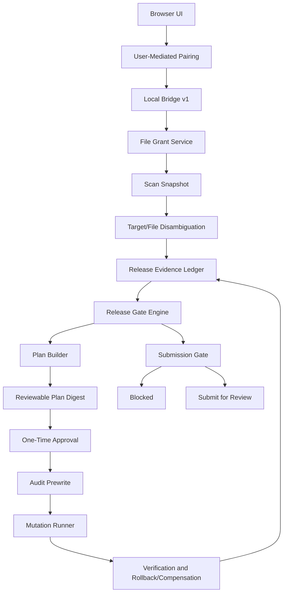

# iOS Release Assistant Final Improvement PRD

**Date**: 2026-06-10  
**Category**: app  
**Slug**: ios-release-assistant-final-improvement-prd  
**Scope**: `/Users/pomfs_agent/POMFS/POMFS-iOS-App/ios-release-assistant` 전체, `/Users/pomfs_agent/POMFS/POMFS-iOS-App` iOS 앱 저장소, `release-history`, Apple App Store Connect/Xcode 공식 요구사항  
**Process**: `goal-pomfsdev-prd-plan` leader synthesis, Data/Backend input, Bridge/Security input, Hypatia critical audit, Popper Security/SRE audit, validation loop  
**Status**: 사용자 피드백 전 최종 PRD. 제품 구현의 P0/P1은 아직 남아 있으며, 이 문서는 모든 P0/P1을 hard gate, no-go 조건, 수용 기준으로 닫는다.

## Summary

iOS Release Assistant는 단순 체크리스트 UI가 아니라 "증거 기반 iOS 출시 준비 판정기"가 되어야 한다. 현재 코드베이스는 로컬 스캔, preflight, review 요약, backup/write, `xcodegen generate`, App Store Connect metadata update, media upload, review submission까지 넓은 기능 표면을 갖고 있다. 그러나 이 기능들이 Apple 제출에 필요한 build/archive/upload/build selection/compliance chain과 하나의 검증 가능한 evidence ledger로 묶여 있지 않다.

최종 개선 방향은 다음과 같다.

- `xcodegen generate`는 release-ready 증거가 아니다. project regeneration 증거일 뿐이다.
- local bridge는 localhost와 정적 confirmation token을 신뢰하지 않는다. pairing, origin pinning, file grant, one-time approval, audit log가 모두 필요하다.
- App Store Connect mutation은 state machine, idempotency, fresh precondition, partial-success compensation, rollback/manual recovery plan을 갖는 job으로만 실행한다.
- POMFS 모드는 `release-history`의 `partial`, `source-ready`, `xcodebuild was not run` 예외를 자동 차단 근거로 사용한다.
- 모든 P0/P1은 product warning이 아니라 hard no-go gate다. gate를 통과하지 않으면 UI는 "출시 가능", "제출 가능", "ready" 상태를 표시하지 않는다.

## Current-State Evidence

### Repo / Product

- `docs/product-plan.md`는 초보자용 iOS 출시 보조 도구와 로컬 설치판/온라인판 분리를 목표로 한다.
- `docs/product-plan.md`는 초기 MVP에서 "final App Review 제출 버튼은 누르지 않는다"는 원칙을 담고 있지만, 현재 구현은 review submission endpoint와 UI를 갖고 있다.
- `docs/architecture-plan.md`는 local-first bridge와 safe write 원칙을 제안하지만, 일부 status는 현재 코드보다 오래되어 구현/문서 싱크가 필요하다.
- `project.yml`와 `P.O.MFS/Info.plist`는 POMFS iOS 앱의 bundle id, version/build placeholder, target family, signing 설정을 정의한다.
- `P.O.MFS/Info.plist`에는 `NSAllowsArbitraryLoads=true`가 남아 있어 ATS exception 근거를 release gate로 요구해야 한다.

### Bridge / Security

- `server/local-server.mjs:143-155`의 `/api/bridge/pair`는 POST 한 번으로 pairing token을 반환한다.
- `server/bridge/policy.mjs:198-239`는 loopback origin과 missing origin을 넓게 허용한다.
- `src/api/bridge.ts:21-27`와 `server/appStoreConnect.mjs:6-13`은 backup/write/generate/ASC confirmation token이 정적 문자열임을 보여준다.
- `server/local-server.mjs:589-602`는 legacy `/api/scan-folder`가 `/api/bridge/*` 정책 밖에서 동작함을 보여준다.
- `server/appStoreConnect.mjs:1363-1372`는 ASC private key가 bridge memory session에 저장됨을 보여준다.
- `server/appStoreConnect.mjs:1430-1530`은 draft metadata update, media upload, review submit mutation surface가 이미 구현되어 있음을 보여준다.

### Data / Client

- `src/data/preflightChecks.ts`는 local metadata와 manual confirmation 중심이며 archive/export/upload/build processing evidence를 요구하지 않는다.
- `src/data/changeReviewSummary.ts`는 display model이지 release execution contract가 아니다.
- `src/types.ts:247-265`의 review submission plan/result는 build/compliance evidence를 포함하지 않는다.
- `src/types.ts:352-390`의 folder scan result는 snapshot fingerprint, resolved build settings, evidence ledger를 포함하지 않는다.
- `src/components/StoreConnectPanel.tsx:641-719`는 review submission UI를 제공하지만 selected build와 processing state gate가 충분하지 않다.

### POMFS / Environment / Test

- `release-history/releases/2026-05-22_r1_50_1_ios_payment_webview.json`와 `2026-05-22_r1_50_3_ios_scoped_location_webview.json`는 `verification.status=partial`, `rollout.status=source-ready`, `xcodebuild was not run` 예외를 기록한다.
- 2026-06-10 KST 기준 `xcode-select --print-path`는 `/Library/Developer/CommandLineTools`이고 `xcodebuild -version`은 full Xcode 부재로 실패했다.
- validation loop에서 `npm test`는 3개 파일, 39개 테스트 모두 통과하도록 복구되었다.
- validation loop에서 `npm run build`는 통과했다.

## Problem Statement

현재 제품은 위험한 변경 기능을 이미 제공하지만, 그 변경이 실제 App Store 제출 가능 상태인지 증명하는 chain이 부족하다. 사용자는 `xcodegen generate`, metadata PATCH, screenshot upload, review submit 같은 개별 성공을 "출시 준비 완료"로 오해할 수 있다.

출시 준비 판정은 다음 증거 없이는 성립하지 않는다.

- full Xcode 26+와 iOS 26 SDK로 build setting resolve, archive, export, upload를 수행했다.
- App Store Connect에서 업로드된 build가 processing 완료되었고 해당 app version에 정확히 선택되었다.
- metadata, privacy, age rating, export compliance, SDK privacy manifest, media processing, review detail이 제출 가능한 상태다.
- POMFS `release-history`에 남은 partial/source-ready/xcodebuild 예외가 해결되었다.
- 로컬 파일 변경, command execution, ASC mutation이 사용자 승인, audit log, backup, rollback 또는 compensation evidence를 남겼다.

## Goals

- iOS Release Assistant를 evidence-based release readiness assistant로 재정의한다.
- `source-ready`, `metadata-ready`, `build-ready`, `submission-ready`, `release-ready` 상태를 분리한다.
- local bridge 권한 모델을 pairing, origin-bound session, file grant, one-time approval, audit log로 재설계한다.
- archive/export/upload/build selection/compliance/media/review submission chain을 Release Evidence Ledger로 통합한다.
- POMFS release-history를 release blocker source로 사용한다.
- 모든 P0/P1 리스크를 구현 수용 기준과 no-go 조건으로 만든다.
- 초보자에게는 쉬운 언어로 blocker를 보여주되, product state는 technical evidence만으로 계산한다.

## Non-Goals

- Apple ID/password 입력 또는 저장은 지원하지 않는다.
- 온라인 서버가 사용자의 소스 코드, ASC private key, 로컬 명령 실행 권한을 소유하지 않는다.
- PRD MVP에서 모든 ASC 기능을 자동화하지 않는다. 안전하게 모델링되지 않은 항목은 manual evidence로 유지한다.
- `MusicFeedPlatform`은 생산 대상이 아니며 구현/배포 기준으로 사용하지 않는다.
- App Review 제출 자동화는 MVP의 기본값이 아니다. hard gates를 모두 통과하고 별도 high-risk approval이 있을 때만 가능하다.

## System Invariants

1. Release-ready is evidence, not optimism. 수동 체크만으로 release-ready가 될 수 없다.
2. Project generation is not submission readiness. `xcodegen generate`는 archive/export/upload/build selection을 대체하지 않는다.
3. Pairing is not mutation approval. pairing은 세션 연결이고 mutation은 별도 one-time approval을 요구한다.
4. Raw path is not permission. 모든 파일 접근은 grant ID와 `realpath` boundary 검사를 통과해야 한다.
5. No submit without selected processed build. review submission은 build relationship과 processing state가 검증되지 않으면 호출할 수 없다.
6. No write without backup and rollback path. 파일 mutation은 backup manifest, pre-image hash, atomic write, verification, rollback plan을 요구한다.
7. No external mutation without fresh remote precondition. ASC mutation은 실행 직전 remote state와 plan snapshot이 일치해야 한다.
8. Placeholder preservation is mandatory. `$(PRODUCT_BUNDLE_IDENTIFIER)`, `$(MARKETING_VERSION)`, `$(CURRENT_PROJECT_VERSION)` 같은 build setting placeholder를 concrete 값으로 덮어쓰지 않는다.
9. Release-history exceptions are blockers. `partial`, `source-ready`, `xcodebuild was not run`은 release-ready를 자동 차단한다.
10. Secrets stay local and memory-only. ASC private key, JWT, token, demo password는 저장, 로그, 보고서, screenshot에 남기지 않는다.

## Target Architecture



### Recommended Option

Adopt a local-first, evidence-driven architecture.

- UI renders plans, blockers, and evidence states.
- Bridge owns local privileges, file grants, approvals, ASC JWT signing, command execution, audit logs, and rollback artifacts.
- Release Gate Engine computes `blocked`, `source_ready`, `metadata_ready`, `build_ready`, `submission_ready`, `release_ready`.
- ASC operations run as durable jobs with idempotency keys, fresh preconditions, event logs, and compensation plans.
- Review submission stays disabled until all hard gates pass.

### Rejected Shortcuts

- "Add a warning before submit" is rejected. Submit must be technically impossible without gate evidence.
- "Let the user manually confirm xcodebuild" is rejected for release-ready. Manual notes can produce `source_ready`, not `release_ready`.
- "Trust localhost because it is local" is rejected. Loopback origins and local processes are not consent boundaries.
- "Keep static confirmation tokens but hide them in UI" is rejected. Static strings are not approval evidence.
- "Validate media by extension only" is rejected. Apple device/display, processing, localization, and quantity constraints matter.

## Domain Model

### ReleaseEvidenceLedger

```ts
type ReleaseReadinessState =
  | "blocked"
  | "source_ready"
  | "metadata_ready"
  | "build_ready"
  | "submission_ready"
  | "release_ready";

type EvidenceStatus = "pass" | "warn" | "fail" | "manual_required" | "not_available";

type ReleaseEvidenceLedger = {
  ledgerId: string;
  projectRootGrantId: string;
  scanSnapshotId: string;
  targetSelection: {
    scheme: string;
    target: string;
    configuration: "Release";
    bundleId: string;
    version: string;
    buildNumber: string;
  };
  buildEvidence: BuildEvidence;
  ascVersionEvidence: AscVersionEvidence;
  complianceEvidence: ComplianceEvidence;
  mediaEvidence: MediaEvidence;
  releaseHistoryEvidence: ReleaseHistoryEvidence;
  bridgeSecurityEvidence: BridgeSecurityEvidence;
  readinessState: ReleaseReadinessState;
  blockers: ReleaseBlocker[];
  generatedAt: string;
};
```

### Required Evidence Types

```ts
type BuildEvidence = {
  xcodePath: string;
  xcodeVersion: string;
  sdkVersions: string[];
  showBuildSettingsHash: string;
  archivePath?: string;
  exportPath?: string;
  uploadProvider?: "xcodebuild" | "transporter" | "altool" | "manual";
  uploadedBuildId?: string;
  uploadedVersion?: string;
  uploadedBuildNumber?: string;
  processingState?: "PROCESSING" | "VALID" | "FAILED" | "MISSING";
  status: EvidenceStatus;
};

type AscVersionEvidence = {
  appId: string;
  appStoreVersionId: string;
  appStoreState: string;
  selectedBuildId?: string;
  selectedBuildVersion?: string;
  selectedBuildNumber?: string;
  requiredMetadataComplete: boolean;
  reviewDetailComplete: boolean;
  status: EvidenceStatus;
};

type ComplianceEvidence = {
  privacyPolicyUrl: EvidenceStatus;
  appPrivacyAnswers: EvidenceStatus;
  ageRating2026Questions: EvidenceStatus;
  exportCompliance: EvidenceStatus;
  sdkPrivacyManifest: EvidenceStatus;
  atsExceptionJustification: EvidenceStatus;
  dsaTraderStatusIfEu: EvidenceStatus;
  koreaComplianceIfDistributed: EvidenceStatus;
  status: EvidenceStatus;
};

type BridgeSecurityEvidence = {
  pairedOrigin: string;
  originPinned: boolean;
  staticConfirmationTokensRemoved: boolean;
  legacyUnpairedScanDisabled: boolean;
  fileGrantId: string;
  auditLogPath: string;
  noSecretsPersisted: boolean;
  status: EvidenceStatus;
};
```

### ReleasePlan

```ts
type ReleasePlan = {
  planId: string;
  planHash: string;
  ledgerId: string;
  actions: ReleaseAction[];
  requiredApprovals: ApprovalRequirement[];
  expectedPreconditions: Preconditions;
  rollbackPlan: RollbackPlan;
  noGoBlockers: ReleaseBlocker[];
};
```

### MutationRun

```ts
type MutationRun = {
  runId: string;
  planId: string;
  idempotencyKey: string;
  phase: "queued" | "preflight" | "running" | "verifying" | "completed" | "failed" | "rolled_back" | "manual_recovery";
  eventLogPath: string;
  startedAt?: string;
  completedAt?: string;
  resultDigest?: string;
};
```

## API Contracts

### Bridge Endpoint Rules

- Public endpoints are limited to health/version.
- All project-data and mutation endpoints live under `/api/bridge/v1/*`.
- Legacy `/api/scan-folder` is removed or returns `410 Gone`.
- Browser endpoints reject missing `Origin` unless explicitly marked CLI/native only.
- Exact origin allowlist, `Sec-Fetch-Site`, bearer token, CSRF header, session id, and request id are required.
- Pairing is user-mediated challenge-response, not automatic token return.

### File Grant Rules

- Finder selection or explicit local bridge approval creates a `fileGrantId`.
- Scan/write/media upload receives `fileGrantId`, not arbitrary raw root as authority.
- Server resolves every path with `realpath` and rejects symlink escape.
- Grant scope can be `read_project`, `write_project`, `read_media`, `command_xcodegen`, `command_xcodebuild`, `asc_mutation`.

### Mutation Request

```json
{
  "planId": "plan_123",
  "planHash": "sha256:...",
  "approvalId": "approval_123",
  "idempotencyKey": "uuid",
  "expectedSnapshotId": "scan_123",
  "expectedRemoteVersion": "asc_state_hash"
}
```

### Mutation Response

```json
{
  "jobId": "job_123",
  "phase": "queued",
  "eventStreamUrl": "/api/bridge/v1/jobs/job_123/events",
  "auditLogPath": "~/Library/Application Support/POMFS/iOSReleaseAssistant/audit/job_123.jsonl"
}
```

### Blocked Response

```json
{
  "state": "blocked",
  "blockers": [
    {
      "id": "RG-01",
      "severity": "P0",
      "title": "Processed build is not selected on App Store version",
      "requiredEvidence": ["AscVersionEvidence.selectedBuildId", "BuildEvidence.processingState=VALID"]
    }
  ]
}
```

### App Store Connect Rules

- ASC private key is memory-only and cleared on disconnect, TTL expiry, bridge shutdown, or user revoke.
- JWT TTL is short and never exceeds Apple API token lifetime constraints.
- JWT, private key, bearer token, demo password, and app-specific credentials are redacted in logs/responses.
- Mutation plans are generated from fresh ASC reads and executed only if resource preconditions still match.
- Review submission uses the current Review Submissions API surface where available and must not depend on deprecated version-submission behavior without documented compatibility proof.
- Destructive or externally visible actions require red action UI, one-time approval, and audit prewrite.

## Client / UX Behavior

- The main dashboard shows readiness states with blocker counts and concrete next actions.
- Buttons for write/generate/upload/submit are disabled by server-computed blockers, not only client-side booleans.
- Plan digest shows exact target, scheme, bundle id, version/build, file paths, ASC app/version/build ids, operation count, rollback/compensation plan, and risk class.
- Beginner mode simplifies language but does not hide side effects.
- Advanced mode exposes raw evidence, hashes, ASC ids, job events, and links to audit logs.
- Paths are shown redacted by default, with explicit reveal for local user only.
- "Submit for Review" is visually and technically separated as a highest-risk action.

## Security / Privacy Requirements

### P0 Requirements

- Remove static confirmation tokens from client and server mutation flow.
- Pairing requires bridge-local user consent and origin-bound token issuance.
- Disable or gate every legacy unpaired project-data endpoint.
- Enforce file grants and realpath boundary checks for scan, write, backup, generate, and media upload.
- Require one-time approval bound to action, plan hash, file snapshot hash, remote ASC state hash, origin, and TTL.
- Bind mutation execution to idempotency keys and durable job state.
- Create audit prewrite before any local file write, command execution, ASC update, media upload, or review submission.
- Block review submission unless selected processed build, required metadata, compliance, media, and review detail are all green.
- Never persist ASC private key, JWT, bearer token, demo password, or other secrets.
- Redact secrets in logs, responses, reports, screenshots, and test snapshots.

### P1 Requirements

- Add root-level writer queue and ASC mutation queue.
- Add append-only JSONL audit log and SSE/WebSocket job event stream.
- Add rollback endpoint for local file writes and generated-project changes.
- Add ASC partial-success compensation plan for every operation group.
- Add media validation for dimensions, orientation, count, video codec/duration, localization, and ASC processing state.
- Add compliance matrix for privacy URL, App Privacy answers, SDK privacy manifests, age rating, export compliance, ATS exception justification, DSA/Korea requirements where applicable.
- Add route/capability parity tests so UI cannot call undocumented mutation endpoints.
- Add incident response runbook and local key revocation instructions.

## Observability / SLO

### Audit Event Fields

Each event log line must include:

- `timestamp`, `sequence`, `jobId`, `sessionId`, `origin`, `action`, `phase`
- `planHash`, `snapshotId`, `idempotencyKey`
- `fileGrantId`, `ascAppId`, `ascVersionId`, `ascBuildId` when applicable
- `preconditionHash`, `resultHash`, `rollbackStatus`
- `messageRedacted`, `errorCode`, `recoverability`

### Local SLOs

- Pairing challenge creation p95 under 500 ms.
- Project scan p95 under 10 s for normal POMFS repo size, with progress events for longer scans.
- Plan generation p95 under 3 s after scan snapshot.
- Local file mutation completes or rolls back within 30 s for normal plist/yml changes.
- ASC mutation jobs emit heartbeat at least every 5 s.
- Media upload jobs expose progress and processing state, and do not mark ready until ASC processing is complete.

### Incident Response

- Provide "Disconnect ASC" and "Revoke local session" controls.
- Show "Rotate/Revoke App Store Connect API key" instructions after suspected exposure.
- Keep audit logs local and redacted.
- Provide exportable incident bundle without secrets.
- Provide manual recovery checklist for partial ASC mutation and local rollback failure.

## Migration / Rollback

1. Baseline: keep current read-only scan/preflight visible, but label current release readiness as `source_ready` at most.
2. Bridge Security Foundation: introduce v1 pairing, origin pinning, file grants, one-time approval, and disable legacy scan.
3. Evidence Ledger: add snapshot IDs, target selection, build settings resolution, release-history reader, and blocker engine.
4. Local Mutation Hardening: add atomic writes, root queue, rollback endpoint, generated-project recovery, and audit events.
5. Build/Upload Chain: add full Xcode detection, Xcode 26+/SDK 26 gate, showBuildSettings, archive, export, upload, build processing evidence.
6. ASC Mutation Hardening: convert metadata/media/review operations to durable jobs with fresh preconditions and compensation plans.
7. Submission Gate: enable review submission only after all hard gates are green and a high-risk approval is issued.

Rollback behavior:

- Local writes restore from backup manifest and verify hashes.
- `xcodegen generate` stores pre/post file manifests and offers restore or manual diff.
- ASC metadata changes produce a reverse patch when ASC API supports it, or a manual recovery checklist when it does not.
- Media upload partial success records asset ids and delete/retry guidance.
- Review submission cannot be automatically rolled back; therefore it requires the strictest pre-submit gate and final approval.

## Testing Plan

### Current Validation

- `npm test`: passed, 3 files, 39 tests, 2026-06-10 KST validation loop.
- `npm run build`: passed, 2026-06-10 KST validation loop.
- `xcodebuild -version`: failed because active developer directory is Command Line Tools, not full Xcode. This remains a release no-go for actual archive/upload/submission readiness.

### Required Test Suites

- Bridge policy tests: origin pinning, missing origin rejection, CSRF, Sec-Fetch, token expiry, revocation.
- Pairing tests: challenge-response, origin-bound session, failed replay, wrong origin, expired code.
- File grant tests: symlink escape, path traversal, revoked grant, media path outside grant, scan outside grant.
- Mutation approval tests: plan hash mismatch, expired approval, reused approval, wrong action, wrong snapshot.
- Safe write tests: atomic write, pre-image mismatch, rollback success, rollback failure recovery, placeholder preservation.
- Command runner tests: allowlisted binary, sanitized env, timeout, output cap, process group kill, redaction.
- ASC tests: connect/disconnect TTL, key redaction, fresh precondition mismatch, idempotency retry, partial success compensation.
- Media tests: screenshot dimensions, count, type, localization, video duration/codec, processing state.
- Review submission tests: no selected build, processing build, missing metadata, missing compliance, missing media, deprecated API fallback proof.
- Release-history tests: partial/source-ready/xcodebuild exception blocks release-ready.
- End-to-end dry run: scan -> evidence ledger -> blocked -> fix evidence -> plan -> approval -> mutation job -> verification.

## Release Gates / No-Go Conditions

### Hard No-Go

- Any failing `npm test` or `npm run build`.
- Full Xcode is missing, or Xcode 26+/SDK 26 evidence is missing for App Store upload readiness.
- `xcodebuild -showBuildSettings`, archive, export, upload, or ASC build processing evidence is missing.
- Uploaded processed build is not selected on the target App Store version.
- Required metadata, privacy, age rating, export compliance, review detail, or media evidence is incomplete.
- Legacy unpaired scan/project-data endpoint is reachable.
- Static confirmation token remains in any mutation path.
- File scan/write/media upload accepts arbitrary absolute path without grant boundary.
- Audit prewrite is missing for any mutation.
- ASC private key/JWT/session cannot be disconnected, expired, and redacted.
- Review submission uses a deprecated/incompatible API path without documented proof and tests.
- POMFS release-history has unresolved `partial`, `source-ready`, or `xcodebuild was not run` exception.
- App Store media is uploaded but ASC processing is incomplete or failed.
- Local rollback or ASC compensation plan is missing for a mutation that can partially succeed.

### Soft Gate / Warning

- Manual compliance evidence is present but not machine-verified.
- Media is valid but lacks optimal device coverage.
- App preview processing may take up to 24 hours.
- ATS exception is justified but should be minimized before public release.
- Hosted UI cannot reach local bridge due browser local network policy, requiring local-served fallback.

## Implementation WBS

### Milestone 0: Baseline and Regression Lock

Deliverables:

- Test suite green at start of implementation.
- Current endpoint inventory and route/capability parity snapshot.
- Current release-history exception inventory.

Acceptance:

- `npm test` and `npm run build` pass.
- No new mutation feature can merge without a release gate test.

### Milestone 1: Bridge Security Foundation

Deliverables:

- `/api/bridge/v1/*` route namespace.
- User-mediated pairing.
- Exact origin pinning.
- CSRF and Fetch Metadata enforcement.
- File grant service.
- Static confirmation token removal.
- Legacy scan disabled or gated.

Acceptance:

- Malicious loopback origin cannot pair or mutate.
- No mutation endpoint accepts static client token as approval.
- Scan/write/media upload outside grant is rejected.

### Milestone 2: Evidence Ledger

Deliverables:

- `ReleaseEvidenceLedger` persisted locally.
- Snapshot ids and target/file disambiguation.
- POMFS release-history reader.
- Blocker engine and readiness state.

Acceptance:

- POMFS partial/source-ready/xcodebuild exception blocks release-ready.
- Multiple targets or multiple candidate files block mutation until user selects target identity.

### Milestone 3: Build/Upload Chain

Deliverables:

- Full Xcode detection.
- Xcode 26+/SDK 26 gate.
- showBuildSettings capture.
- archive/export/upload job model.
- ASC build processing poller and build selection evidence.

Acceptance:

- Release-ready cannot be reached with Command Line Tools only.
- Build-ready cannot be reached without processed uploaded build selected on the App Store version.

### Milestone 4: Local Mutation Hardening

Deliverables:

- Root-level writer queue.
- Atomic write and fsync/rename.
- Backup manifest with rollback endpoint.
- Command runner sandbox policy.
- Redacted audit log and job events.

Acceptance:

- Pre-image mismatch stops write.
- Failed verification triggers rollback or manual recovery state.
- Command execution has timeout, allowlist, env sanitization, and output cap.

### Milestone 5: ASC Mutation Hardening

Deliverables:

- ASC session TTL/disconnect.
- Fresh precondition check.
- Idempotency key handling.
- Partial-success compensation plan.
- Metadata/media/review jobs.

Acceptance:

- Remote state drift blocks execution.
- Replayed mutation request does not duplicate external changes.
- Partial success produces deterministic recovery instructions.

### Milestone 6: Compliance and Media Readiness

Deliverables:

- Privacy/compliance matrix.
- SDK privacy manifest inventory.
- Age rating/export compliance gates.
- Screenshot/app preview validation and processing state tracking.

Acceptance:

- Review submission is blocked by missing privacy/compliance/media evidence.
- Media upload success alone does not mark ready until processing is complete.

### Milestone 7: Submission Gate

Deliverables:

- High-risk red action workflow.
- Final plan digest.
- One-time submit approval.
- Review submission API compatibility proof and tests.

Acceptance:

- Submit button does not render or execute unless all hard gates pass.
- Submission event has audit prewrite, final evidence digest, and post-submit verification.

## PRD Security Requirements for Implementation

| ID | Requirement | Severity | Acceptance |
| --- | --- | --- | --- |
| SR-01 | Static confirmation tokens are removed from all mutation paths. | P0 | Tests fail if a client bundle constant can authorize mutation. |
| SR-02 | Pairing requires bridge-local user consent. | P0 | Automated POST to `/pair` cannot receive token. |
| SR-03 | Sessions are origin-bound and revocable. | P0 | Token replay from different origin returns 401/403. |
| SR-04 | File access requires grant and realpath boundary. | P0 | Symlink/path traversal and outside-root media upload are rejected. |
| SR-05 | Mutation approval is one-time and plan-hash bound. | P0 | Reuse, expiry, wrong action, wrong plan hash all fail. |
| SR-06 | Audit prewrite exists before side effects. | P0 | Mutation without audit event cannot run. |
| SR-07 | ASC private key/JWT are memory-only and redacted. | P0 | Log/response snapshot tests contain no secret material. |
| SR-08 | Review submission requires selected processed build and compliance evidence. | P0 | Missing evidence blocks endpoint and UI. |
| SR-09 | Mutations run through durable jobs with idempotency. | P1 | Retry does not duplicate external or local side effects. |
| SR-10 | Incident response and revoke instructions are visible. | P1 | User can disconnect ASC, revoke session, and export redacted incident bundle. |

## Open Decisions

- Should the product ship as purely local desktop app, local web bridge, hosted UI plus local bridge, or all three?
- Where should the local ledger and audit logs live by default, and what is the retention policy?
- Which ASC role should be recommended as minimum viable role for metadata/media/review workflows?
- Should archive/upload be automated in MVP or recorded as guided manual evidence first?
- Should review submission remain experimental until the Review Submissions API path is fully implemented and tested?
- Should POMFS release-history integration be a generic plugin interface or a POMFS-specific mode?

## Critical Audit Result

Hypatia and Popper findings are not dismissed. They are converted into hard gates and implementation acceptance criteria. The PRD has no intentional P0/P1 design exception left. The product implementation remains blocked from "release-ready" or "submit-ready" claims until the gates above are implemented and verified.

The validation loop fixed current test regressions in ASC draft metadata planning, review-note fallback expectations, and app preview state selection, then confirmed:

- `npm test`: 39/39 passed.
- `npm run build`: passed.

The environment still cannot provide actual iOS archive/upload evidence because full Xcode is not active. Therefore this PRD explicitly blocks App Store upload/submission readiness until Xcode 26+/SDK 26 and build processing evidence exist.

## References

- Apple Upcoming Requirements: <https://developer.apple.com/news/upcoming-requirements/>
- Apple Upload Builds: <https://developer.apple.com/help/app-store-connect/manage-builds/upload-builds/>
- Apple Submit an App: <https://developer.apple.com/help/app-store-connect/manage-submissions-to-app-review/submit-an-app/>
- Apple Screenshot Specifications: <https://developer.apple.com/help/app-store-connect/reference/app-information/screenshot-specifications/>
- Apple Upload App Previews and Screenshots: <https://developer.apple.com/help/app-store-connect/manage-app-information/upload-app-previews-and-screenshots/>
- Apple Third-Party SDK Requirements: <https://developer.apple.com/support/third-party-SDK-requirements/>
- Apple App Store Connect API Tokens: <https://developer.apple.com/documentation/appstoreconnectapi/generating-tokens-for-api-requests>
- Apple Revoke API Keys: <https://developer.apple.com/documentation/appstoreconnectapi/revoking-api-keys>
- Apple Review Submissions API: <https://developer.apple.com/documentation/appstoreconnectapi/post-v1-reviewsubmissions>
- Local report: `CODEX_REPORTS/app/2026-06-10_ios-release-assistant-data-backend-prd-input.md`
- Local report: `CODEX_REPORTS/app/2026-06-10_ios-release-assistant-bridge-prd.md`
- Local report: `CODEX_REPORTS/app/2026-06-10_ios-release-assistant-release-readiness-prd.md`
- Local report: `CODEX_REPORTS/audits/2026-06-10_ios-release-assistant-hypatia-critical-audit.md`
