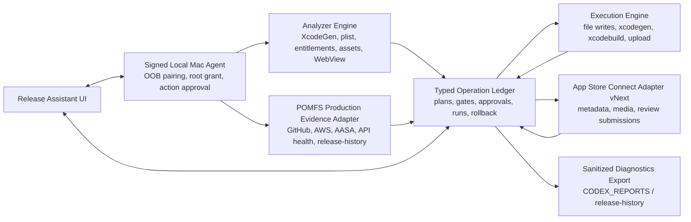

# iOS Release Assistant 전체 코드베이스 개선 PRD

**Date**: 2026-06-10  
**Category**: app  
**Slug**: ios-release-assistant-full-codebase-prd  
**Scope**: `/Users/pomfs_agent/POMFS/POMFS-iOS-App/ios-release-assistant`, `/Users/pomfs_agent/POMFS/POMFS-iOS-App`, POMFS production evidence, App Store Connect/Xcode release constraints  
**Process**: `goal-pomfsdev-prd-plan` 기반 병렬 전문 감사, 리더 종합, Hypatia critical audit 반영  
**Mode**: PRD/report only. 이 문서 작성 중 제품 코드는 수정하지 않았다.  
**Production Baseline**: `https://community.prideofmisfits.com/`, AWS/GitHub production stack, current POMFS repositories. `MusicFeedPlatform`은 production baseline으로 사용하지 않는다.

## Summary

iOS Release Assistant의 목표 상태는 체크리스트 UI가 아니라 **증거 기반 iOS 릴리즈 오케스트레이터**다. 현재 도구는 로컬 프로젝트 스캔, XcodeGen 기반 write plan, backup/apply/generate, App Store Connect draft/media/review 보조까지 넓은 기능을 갖고 있다. 그러나 App Store 제출 가능성을 책임지려면 `xcodegen generate` 성공이나 사용자 체크박스가 아니라 full Xcode, archive/export/upload, ASC build processing, build selection, metadata/privacy/media readiness, POMFS production evidence가 하나의 release ledger에 묶여야 한다.

권장 아키텍처는 **Local-first Release Orchestrator + Signed Local Mac Agent + POMFS Production Evidence Adapter + Typed Operation Ledger**다. PRD 기준 P0/P1은 "현재 코드가 모두 고쳐졌다"가 아니라 "구현 전 no-go gate와 milestone acceptance로 모두 소유되었다"는 뜻으로 닫는다.

현재 검증 결과:

- `npm test`: 통과, 3 files / 39 tests passed.
- `npm run build`: 통과.
- `xcodebuild -version`: 실패. active developer directory가 `/Library/Developer/CommandLineTools`라 full Xcode archive/export/upload evidence는 만들 수 없다. 이 상태는 release-ready 차단 조건이다.

## Priority Order

1. **P0 Secure Bridge Foundation**: 정적 confirmation token, 사용자 확인 없는 pairing, unpaired legacy scan endpoint, 넓은 loopback trust 제거.
2. **P0 Release Evidence Chain**: full Xcode, build settings, archive/export/upload, ASC build processing, build selection을 release-ready 필수 증거로 승격.
3. **P0 Review Submission Gate**: processed build relationship, required metadata, privacy/compliance, media readiness 없이는 submit plan 자체를 만들 수 없게 함.
4. **P0 Transactional Operation Ledger**: 파일/명령/ASC mutation을 plan digest, one-time approval, backup, rollback/compensation, audit event로 통합.
5. **P0 POMFS Production Evidence Adapter**: GitHub/AWS/live site/AASA/API health/release-history를 POMFS mode의 source of truth로 고정.
6. **P1 Media/Privacy/Compliance Matrix**: Apple screenshot/app preview 규격, processing state, privacy data, SDK manifest, age rating, export compliance를 gate로 모델링.
7. **P1 Source Selection Safety**: multi-target/file ambiguity, Info.plist placeholder overwrite, production entitlement deletion을 차단.
8. **P1 Observability/SLO/Runbook**: secret-free diagnostics export, gate failure remediation, incident/runbook, CI regression coverage 정리.

## Findings

### F1. Local bridge mutation 보안이 release-grade가 아니다

`/api/bridge/pair`는 사용자 out-of-band 확인 없이 token을 발급하고, mutation confirmation은 클라이언트/서버 정적 문자열에 의존한다. `Origin`이 없거나 allowlist 밖 loopback origin도 허용된다. 로컬 브리지는 파일 쓰기, `xcodegen`, ASC private key/JWT, ASC mutation을 다루므로 loopback 자체는 보안 경계가 아니다.

Required resolution:

- Pairing과 mutation approval을 분리한다.
- Pairing은 bridge-local confirmation code, origin pinning, device/session fingerprint, TTL을 요구한다.
- Mutation은 plan digest에 묶인 one-time nonce와 explicit action approval을 요구한다.
- legacy `/api/scan-folder`는 제거하거나 paired bridge 정책으로 흡수한다.

### F2. `xcodegen generate`와 App Store 제출 준비가 혼동될 수 있다

현재 도구는 project generation, write plan, ASC draft/media/review 기능을 제공하지만 full Xcode 설치, build settings resolve, archive/export/upload, ASC build processing, selected build relationship이 release-ready 판정의 필수 state로 통합되어 있지 않다.

Required resolution:

- `source-ready`, `metadata-ready`, `build-ready`, `submission-ready`, `release-ready`를 분리한다.
- `xcodegen generate`는 project regeneration evidence로만 기록한다.
- full Xcode 및 SDK 요구사항, archive/export/upload, ASC processed build selection 없이는 `release-ready=false`다.

### F3. Review submission은 build/compliance/media 증거 없이 독립 기능이 될 수 없다

ASC review submit plan은 appStoreVersion 상태 중심으로 동작하며, 선택된 build id, processing state, required metadata completion, media processing, privacy/compliance completeness를 강한 precondition으로 보장하지 않는다.

Required resolution:

- Review submission은 별도 opt-in 고위험 mutation으로 둔다.
- `ReviewSubmissionPlan`은 selected processed build, required metadata, review detail, privacy/compliance, screenshots/previews processing readiness를 모두 포함한다.
- 하나라도 missing이면 submit endpoint는 409/blocked 상태를 반환하고 UI는 버튼을 렌더링하지 않는다.

### F4. POMFS production source-of-truth가 도구 모델에 충분히 반영되지 않았다

POMFS iOS 앱은 production web wrapper다. release readiness는 local plist만으로 결정되지 않고 live site, AASA, associated domains, auth/payment origins, API health, AWS deploy state, release-history 예외와 연결된다.

Required resolution:

- POMFS mode는 GitHub target ref, local dirty/behind state, live `community.prideofmisfits.com`, AASA, API health, AWS ECS/ALB/CloudFront/Route53 evidence, release-history를 read-only snapshot으로 만든다.
- `MusicFeedPlatform`이 production evidence로 쓰이면 test failure다.
- release-history의 `partial`, `source-ready`, `xcodebuild not run` 예외는 archive/upload evidence가 생기기 전까지 release blocker다.

### F5. File mutation은 rollback 가능한 transaction이어야 한다

현재 backup/apply/rescan은 존재하지만 plan digest, pre-image hash, post-verify, injected failure rollback, partial success recovery가 product contract로 충분히 고정되어 있지 않다. Info.plist build setting placeholder와 production entitlement 삭제도 위험하다.

Required resolution:

- 모든 file mutation은 precondition hash, backup manifest, atomic write, post-verify, rollback point, audit event를 갖는다.
- `$(PRODUCT_BUNDLE_IDENTIFIER)`, `$(MARKETING_VERSION)`, `$(CURRENT_PROJECT_VERSION)`는 기본적으로 concrete value로 덮지 않는다.
- Apple Sign-In, Associated Domains, production APNs entitlement 삭제는 high-risk destructive gate로 분류한다.

## Evidence

- `/Users/pomfs_agent/POMFS/POMFS-iOS-App/ios-release-assistant/package.json` — `build`는 `tsc --noEmit && vite build`, `test`는 `vitest run`.
- `/Users/pomfs_agent/POMFS/POMFS-iOS-App/ios-release-assistant/server/local-server.mjs:143` — `/api/bridge/pair` token 발급 surface.
- `/Users/pomfs_agent/POMFS/POMFS-iOS-App/ios-release-assistant/server/local-server.mjs:589` — legacy `/api/scan-folder`가 bridge policy 밖에 남아 있음.
- `/Users/pomfs_agent/POMFS/POMFS-iOS-App/ios-release-assistant/src/api/bridge.ts:21`, `server/writePlan.mjs:12`, `server/appStoreConnect.mjs:6` — 정적 confirmation token surface.
- `/Users/pomfs_agent/POMFS/POMFS-iOS-App/ios-release-assistant/server/bridge/policy.mjs:223` 및 `:227` — Origin 없음/allowlist 밖 loopback 허용.
- `/Users/pomfs_agent/POMFS/POMFS-iOS-App/ios-release-assistant/server/writePlan.mjs:81` 및 `:89` — target/file 후보 fallback 위험.
- `/Users/pomfs_agent/POMFS/POMFS-iOS-App/ios-release-assistant/server/writePlan.mjs:316` — Info.plist `CFBundleIdentifier` concrete write 위험.
- `/Users/pomfs_agent/POMFS/POMFS-iOS-App/ios-release-assistant/server/writePlan.mjs:329` — entitlements 삭제 operation 위험.
- `/Users/pomfs_agent/POMFS/POMFS-iOS-App/ios-release-assistant/server/appStoreConnect.mjs:561` — media validation이 file 존재/크기/확장자 중심.
- `/Users/pomfs_agent/POMFS/POMFS-iOS-App/ios-release-assistant/server/appStoreConnect.mjs:1048` 및 `:1492` — review submission path가 build evidence chain과 분리될 수 있음.
- `/Users/pomfs_agent/POMFS/POMFS-iOS-App/project.yml` — POMFS target `P.O.MFS`, bundle id `com.prideofmisfits.community`, automatic signing, marketing/build version source.
- `/Users/pomfs_agent/POMFS/POMFS-iOS-App/P.O.MFS/Info.plist` — bundle/version/build placeholder와 ATS exception evidence.
- `/Users/pomfs_agent/POMFS/POMFS-iOS-App/P.O.MFS/Entitlements/Entitlements.plist` — production APNs, Associated Domains, Apple Sign-In.
- `curl https://api.prideofmisfits.com/api/health` — production API health returned healthy/DB connected during investigation.
- `curl https://community.prideofmisfits.com/.well-known/apple-app-site-association` — live AASA returned `LT47CYB8SL.com.prideofmisfits.community`.
- AWS ECS production evidence — `prideofmisfits-community/community-web` and `pomfs-auth-backend-svc-production` were active/running during investigation.
- `npm test` in `ios-release-assistant` — 3 files / 39 tests passed on final verification.
- `npm run build` in `ios-release-assistant` — Vite production build passed on final verification.
- `xcodebuild -version` — failed because only Command Line Tools are selected. This blocks archive/export/upload evidence.

## Product Goals

- POMFS production evidence를 release readiness source of truth로 삼는다.
- beginner-friendly UI를 유지하되, 수동 checkbox를 보안/검증 경계로 취급하지 않는다.
- file write, XcodeGen, xcodebuild, ASC metadata/media/review mutation을 typed operation ledger로 통합한다.
- App Store submission은 processed build, required metadata, media, privacy/compliance, release-history exceptions가 모두 green일 때만 가능하게 한다.
- `npm test`, `npm run build`, bridge security regression, ASC mocked contract, transactional rollback, POMFS production evidence dry-run을 release no-go로 고정한다.

## Non-Goals

- 이 PRD 단계에서 제품 코드를 직접 수정하지 않는다.
- Apple ID/password 입력 또는 저장을 지원하지 않는다.
- hosted server가 사용자의 source code, ASC private key, local command 권한을 소유하지 않는다.
- `MusicFeedPlatform`을 active production target으로 사용하지 않는다.
- MVP에서 자동 App Review 제출을 기본 활성화하지 않는다.

## System Invariants

- **No static approvals**: confirmation token은 클라이언트 번들 상수나 서버 상수가 될 수 없다.
- **Pairing is not mutation approval**: pairing은 session 연결이고, destructive/external mutation은 별도 one-time challenge를 요구한다.
- **No unpaired project data**: scan, file browse, media candidate는 paired root grant 안에서만 반환한다.
- **No stale mutation**: 실행 직전 source file hash, selected target, ASC snapshot, production evidence freshness를 재검증한다.
- **No write without rollback**: 파일 mutation은 backup, precondition, post-verify, rollback/compensation을 갖는다.
- **No submit without build evidence**: review submission은 selected processed build와 required evidence가 없으면 불가능하다.
- **No POMFS release without live evidence**: GitHub/AWS/live site/AASA/API health/release-history snapshot 없이 POMFS release-ready가 될 수 없다.
- **No placeholder overwrite**: Xcode build setting placeholder는 concrete 값으로 덮지 않는다.
- **No secret echo**: private key, JWT, token, password는 response/log/report/test output에 원문으로 남지 않는다.

## Target Architecture



## Data Model

```text
ReleaseWorkspace
- workspaceId, rootPath, gitRemote, branch, commitSha, dirtyState
- selectedTargetId, selectedInfoPlistId, selectedEntitlementsId, selectedScheme

SourceSnapshot
- scanSnapshotId, fileHashes, parsedProjectGraph, createdAt

ProductionEvidenceSnapshot
- githubRef, liveUrlStatus, aasaStatus, apiHealthStatus
- awsServices, route53Weights, cloudfrontStatus, releaseHistoryExceptions, collectedAt

ReleasePlan
- planId, sourceSnapshotId, productionEvidenceSnapshotId
- operationDigest, gateResults, status

ApprovalChallenge
- challengeId, planId, operationDigest, action, nonce, expiresAt, usedAt

ExecutionRun
- runId, planId, operationId, status, startedAt, completedAt
- redactedLogs, rollbackRef, postVerifyResult

BuildEvidence
- xcodePath, xcodeVersion, sdkVersions, scheme, configuration
- archivePath, exportPath, uploadProvider, uploadedBuildId
- processingState, selectedBuildRelationship, status

ComplianceEvidence
- privacyPolicyUrl, appPrivacyAnswers, sdkPrivacyManifest
- ageRating, exportCompliance, atsExceptionJustification, status
```

## API Contracts

### Bridge v1

- `GET /api/bridge/v1/health`: bridge version, capabilities, paired state. No project data.
- `GET /api/bridge/v1/descriptor`: non-secret descriptor and fingerprint.
- `POST /api/bridge/v1/pairing/challenge`: short-lived pairing challenge; no token returned yet.
- `POST /api/bridge/v1/pairing/confirm`: bridge-local code confirmation; returns origin-bound session token.
- `POST /api/bridge/v1/grants/project-root`: user-mediated root grant.
- `POST /api/bridge/v1/grants/media-file`: user-mediated media grant.
- `POST /api/bridge/v1/approvals`: creates one-time action approval for `planId + operationDigest + action`.
- `POST /api/bridge/v1/plans/:planId/runs`: executes approved plan operation.

Acceptance criteria:

- replayed nonce: `403`.
- origin mismatch: `403`.
- plan digest mismatch: `409`.
- unpaired scan/path/media access: `401` or `410`.
- legacy `/api/scan-folder`: removed or returns no project data.

### Release Gate Engine

- `POST /api/bridge/v1/release-gates/evaluate`: evaluates source, production, build, ASC, media, compliance, release-history evidence.
- Returns one of `blocked`, `source_ready`, `metadata_ready`, `build_ready`, `submission_ready`, `release_ready`.
- Manual evidence can move only to `source_ready` or `manual_required`; it cannot create `release_ready`.

### App Store Connect Adapter vNext

- Metadata, media, and review submission are durable jobs with idempotency keys.
- JWT private key remains memory-only and has explicit TTL/clear.
- Submit uses current Apple Review Submissions model after official API verification.
- Submit precondition re-fetches ASC state within 60 seconds before mutation.

## Client / PWA Behavior

- UI shows found production evidence separately from defaults/samples.
- `source-ready`, `metadata-ready`, `build-ready`, `submission-ready`, `release-ready` use distinct badges and cannot collapse into one green state.
- High-risk actions show plan diff, selected target identity, source snapshot, remote precondition, rollback point, and one-time approval challenge.
- Submit button is hidden or disabled unless all P0/P1 gates pass; disabled state includes exact blocker and next action.
- POMFS mode displays live production evidence first: GitHub ref, local divergence, live AASA, API health, AWS services, release-history exceptions.

## Security / Privacy / Abuse Controls

- ASC API private key is never written to disk, report, logs, screenshots, or browser storage.
- Bridge logs are structured and redacted by key name, PEM pattern, token/JWT shape, password/demo credential shape.
- Destructive operations require action-specific approval and are rate-limited per session.
- File access is based on grant IDs plus `realpath` boundary checks, not raw path strings.
- Command execution uses explicit binary policy, timeout, redacted output, and version/capability preflight.
- A secret leakage regression suite is a P0 release gate.

## Observability / SLO

- **Secret leakage SLO**: raw secret leakage in bridge response/log/test/report artifacts is 0.
- **Plan integrity SLO**: plan/action/nonce mismatch block rate is 100%.
- **Write verification SLO**: targeted expected/actual match rate is 100%; mismatch triggers rollback or blocked manual recovery.
- **Release evidence SLO**: every `release-ready` state includes Xcode/SDK, archive/export/upload, ASC processing, build selection, media, privacy/compliance, production evidence.
- **ASC freshness SLO**: submit precondition snapshot age is 60 seconds or less.
- **Test SLO**: `npm test`, `npm run build`, bridge security, mocked ASC contract, transactional rollback, POMFS production dry-run are green.

## Migration / Legacy Retirement

1. Add bridge v1 endpoints behind feature flag while keeping current UI read-only compatible.
2. Move scan/path/media access to root grant model.
3. Remove or disable legacy unpaired `/api/scan-folder`.
4. Replace static `CONFIRM_*` tokens with one-time approval challenge.
5. Introduce operation ledger and transactional file mutation.
6. Add POMFS production evidence adapter in read-only mode.
7. Migrate ASC metadata/media/review to durable job model.
8. Add build evidence chain and submit gate.
9. Mark old review submission path deprecated and remove after contract tests cover vNext.

Rollback:

- Bridge v1 can be disabled by feature flag while preserving read-only scan.
- File mutation rollback uses backup manifest and pre-image hashes.
- ASC external mutation cannot be atomically rolled back; every external run requires compensation notes and pre/post ASC snapshots.

## Release Gates

| Gate | Severity | No-Go Condition | Acceptance |
| --- | --- | --- | --- |
| RG-00 Tests | P0 | `npm test` or `npm run build` fails | 0 failed tests/build errors |
| RG-01 Bridge Auth | P0 | static token, unconfirmed pairing, unpaired project data | nonce/origin/replay negative tests pass |
| RG-02 Source Lock | P0 | target/file ambiguity, stale Git ref without override | selected target and source snapshot in plan digest |
| RG-03 Transactional Write | P0 | write without backup/hash/post-verify/rollback | injected failure restores original hashes |
| RG-04 POMFS Production | P0 | missing live/AWS/GitHub/AASA/API/release-history evidence | evidence snapshot attached to release plan |
| RG-05 Build Evidence | P0 | no full Xcode, archive/export/upload, processed build | build evidence state green |
| RG-06 Review Submit | P0 | no selected processed build or required metadata | submit plan cannot be created until green |
| RG-07 Secret Safety | P0 | key/JWT/token/password appears in output | redaction negative tests pass |
| RG-08 Media | P1 | extension-only validation or processing unknown | Apple spec and processing state pass |
| RG-09 Compliance | P1 | privacy/age/export/SDK manifest incomplete | compliance matrix resolved |
| RG-10 Observability | P1 | no audit trail or rollback evidence | sanitized audit export produced |

## Testing Strategy

Required suites:

- Unit tests for parser, gate engine, redaction, data model.
- Bridge security regression for pairing, nonce replay, origin mismatch, unpaired access, root grant boundary.
- Mocked ASC contract tests for metadata update, asset reservation/upload, Review Submissions.
- Transactional write tests with injected failure and rollback verification.
- POMFS read-only production gate tests using sanitized fixtures.
- Client tests for blocked gates, found/default distinction, accessibility basics.

Final verification in this session:

```text
npm test
=> 3 files passed, 39 tests passed

npm run build
=> Vite production build passed

xcodebuild -version
=> failed; active developer directory is Command Line Tools, not full Xcode
```

Interpretation:

- JavaScript/TypeScript test loop is currently green.
- Actual iOS archive/export/upload cannot be verified in this environment and remains a release-ready blocker until run on a full Xcode 26+ Mac with required SDKs.

## WBS

### M0. Evidence Lock

- Freeze current code, GitHub, AWS, live site, release-history, test evidence.
- Deliver P0/P1 register and no-go gate policy.
- Acceptance: no P0/P1 remains without owner, milestone, or gate.

### M1. Secure Bridge Foundation

- Implement OOB pairing, origin-bound session, root grant, one-time approval.
- Retire legacy unpaired scan endpoint.
- Acceptance: replay/origin/unpaired negative tests pass.

### M2. Operation Ledger and File Transactions

- Add typed release plans, approvals, execution runs, rollback points.
- Make file write atomic and verifiable.
- Acceptance: injected partial write failure rolls back.

### M3. POMFS Production Evidence Adapter

- Read GitHub ref, local divergence, live URL/AASA/API health, AWS service state, release-history.
- Acceptance: POMFS mode cannot become release-ready without production evidence.

### M4. Xcode Build Evidence Chain

- Add full Xcode/SDK check, build settings, archive/export/upload evidence, processed build status.
- Acceptance: no processed selected build means no submission-ready.

### M5. App Store Connect Adapter vNext

- Add memory-only credential lifecycle, durable jobs, fresh precondition, Review Submissions model.
- Acceptance: mocked Apple contract tests and secret redaction tests pass.

### M6. Media and Compliance Matrix

- Validate screenshots/previews by Apple display/media constraints and processing state.
- Add privacy/SDK manifest/age/export compliance matrix.
- Acceptance: invalid or incomplete media/compliance blocks submit.

### M7. Beta Rollout

- Package signed local Mac agent or hardened local bridge distribution.
- Add diagnostics export and operator runbook.
- Acceptance: beta user can understand blocked gate and next action without secret leakage.

## Open Decisions

- Whether MVP allows manual upload evidence or requires automated Transporter/xcodebuild upload.
- Which Apple Review Submissions endpoint version is selected after current official API contract verification.
- Whether the signed local agent is packaged as a menu bar app, CLI, or launch agent.
- Where sanitized release ledger is stored long-term: `release-history`, `CODEX_REPORTS`, or both.
- Exact owner for AWS evidence adapter credentials and read-only permission profile.

## Risks / Gaps

- Current Mac cannot run full Xcode release validation; release-ready must be verified elsewhere.
- ASC APIs and Apple requirements change; official documentation must be rechecked before implementation.
- Existing dirty worktree changes were not reverted or normalized; implementation must begin from an explicit source lock.
- External ASC mutations are not atomically rollbackable; compensation and pre/post snapshots are required.
- Subagent audit reports include one earlier test-failure snapshot; current final verification is green, but RG-00 must catch any recurrence.

## Subagent / Supporting Reports

- [Bridge PRD](2026-06-10_ios-release-assistant-bridge-prd.md)
- [Data/Backend PRD Input](2026-06-10_ios-release-assistant-data-backend-prd-input.md)
- [Release Readiness PRD Input](2026-06-10_ios-release-assistant-release-readiness-prd.md)
- [Comprehensive PRD Input](2026-06-10_ios-release-assistant-comprehensive-prd.md)
- [Final Improvement PRD Input](2026-06-10_ios-release-assistant-final-improvement-prd.md)
- [Hypatia Critical Audit](../audits/2026-06-10_ios-release-assistant-hypatia-critical-audit.md)

## References

- Apple App Store Connect API: <https://developer.apple.com/documentation/appstoreconnectapi>
- Creating API keys for App Store Connect API: <https://developer.apple.com/documentation/appstoreconnectapi/creating-api-keys-for-app-store-connect-api>
- Generating tokens for API requests: <https://developer.apple.com/documentation/appstoreconnectapi/generating-tokens-for-api-requests>
- Upload builds: <https://developer.apple.com/help/app-store-connect/manage-builds/upload-builds/>
- Submit an app: <https://developer.apple.com/help/app-store-connect/manage-submissions-to-app-review/submit-an-app/>
- Choose a build to submit: <https://developer.apple.com/help/app-store-connect/manage-builds/choose-a-build-to-submit/>
- Screenshot specifications: <https://developer.apple.com/help/app-store-connect/reference/app-information/screenshot-specifications/>
- Upload app previews and screenshots: <https://developer.apple.com/help/app-store-connect/manage-app-information/upload-app-previews-and-screenshots/>
- App privacy: <https://developer.apple.com/help/app-store-connect/reference/app-information/app-privacy/>
- Upcoming requirements: <https://developer.apple.com/news/upcoming-requirements/>
- OWASP CSRF Prevention Cheat Sheet: <https://cheatsheetseries.owasp.org/cheatsheets/Cross-Site_Request_Forgery_Prevention_Cheat_Sheet.html>
- MDN CORS: <https://developer.mozilla.org/en-US/docs/Web/HTTP/Guides/CORS>
- WICG Local Network Access: <https://wicg.github.io/local-network-access/>

## Follow-Up

- Begin M1 implementation only after selecting the exact source lock and confirming no unrelated dirty changes should be included.
- Run full Xcode archive/export/upload validation on a full Xcode 26+ Mac before any release-ready claim.
- Re-run `npm test`, `npm run build`, bridge security, ASC mocked contract, and POMFS production evidence dry-run after every milestone.
