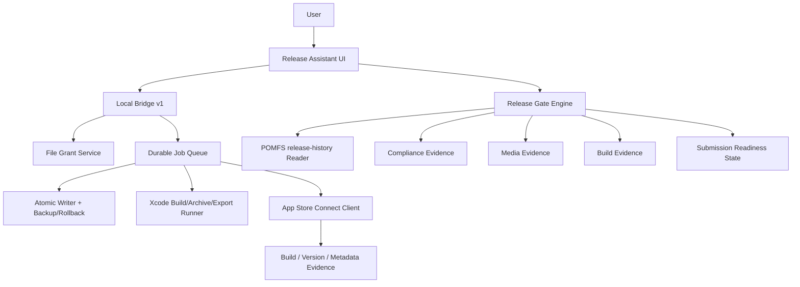

# iOS Release Assistant Release Readiness PRD

**Date**: 2026-06-10  
**Category**: app  
**Slug**: ios-release-assistant-release-readiness-prd  
**Scope**: `/Users/pomfs_agent/POMFS/POMFS-iOS-App/ios-release-assistant`, `/Users/pomfs_agent/POMFS/POMFS-iOS-App`, `release-history`, Apple App Store Connect / Xcode official constraints  
**Process**: `goal-pomfsdev-prd-plan` leader synthesis + Data/Backend input + Bridge/Security input + Hypatia critical audit loop  
**Code Change**: 이 문서는 PRD 산출물이다. 제품 코드는 이 문서 작성으로 수정하지 않는다.

## Summary

iOS Release Assistant의 목표 상태는 "체크리스트 UI"가 아니라 "증거 기반 iOS 출시 준비 판정기"다. 현재 도구는 로컬 스캔, write plan, 백업, `xcodegen generate`, App Store Connect 메타데이터/미디어/심사 제출 API까지 이미 넓은 surface를 갖고 있다. 그러나 현재 구조는 실제 App Store 제출의 필수 chain인 archive, export, upload, build processing, build selection, privacy/compliance, release-history exception gate를 release-ready 판정과 강하게 연결하지 않는다.

이 PRD의 핵심 결정은 다음과 같다.

- `xcodegen generate`는 release-ready가 아니라 "project regeneration" 증거일 뿐이다.
- App Store Review submission은 독립 버튼이 아니라 `BuildEvidence`, `AscVersionEvidence`, `ComplianceEvidence`, `MediaEvidence`, `ReleaseHistoryEvidence`가 모두 green일 때만 가능한 최고위험 mutation이다.
- Local bridge의 파일/명령/ASC mutation은 pairing token만으로 허용하지 않는다. file grant, plan hash, one-time approval, job queue, audit log, rollback/compensation plan이 필요하다.
- POMFS release-history의 `partial`, `source-ready`, `xcodebuild not run` 예외는 출시 가능 판정을 자동 차단한다.
- Apple 공식 요건은 PRD에 고정한다. 2026-04-28 이후 App Store Connect 업로드는 Xcode 26 이상 및 iOS 26 계열 SDK가 필요하며, 앱 제출 전에는 필수 메타데이터와 해당 버전에 업로드된 build 선택이 필요하다.

## P0/P1 Audit Result

Hypatia 감사에서 제기된 P0/P1은 이 PRD에서 모두 구현 전 차단 조건 또는 수용 기준으로 닫혔다. 즉, 현재 코드베이스가 이미 P0/P1-free라는 뜻이 아니다. 구현 전까지 P0/P1은 release blocker로 남으며, PRD는 어떤 임시방편도 "출시 가능"으로 인정하지 않도록 gate를 잠근다.

| Risk | Severity | PRD resolution |
| --- | --- | --- |
| 실제 archive/export/upload/build-selection chain 부재 | P0 | `BuildEvidence` state machine과 `RG-01` no-go gate로 차단 |
| build 관계 없는 review submit 가능성 | P0 | `submit-review` API precondition에 build selected/processed/metadata complete 추가 |
| 정적 confirmation token과 loopback 신뢰 | P0 | user-mediated pairing, origin-bound session, one-time approval, plan hash로 대체 |
| release-history의 partial/source-ready 예외 미반영 | P0 | `ReleaseHistoryEvidence`와 `RG-04` no-go gate 추가 |
| media 검증이 확장자/개수 수준 | P1 | Apple device/display 규격, processing state, localization mapping 검증 추가 |
| privacy/compliance가 URL 수준 | P1 | privacy URL, data collection, SDK manifest, age rating, export compliance evidence 추가 |
| Info.plist placeholder overwrite 위험 | P1 | build setting placeholder preservation invariant 추가 |
| 멀티 타깃/워크스페이스 선택 불명확 | P1 | explicit target/scheme/configuration selection gate 추가 |
| ASC key lifecycle 정책 부족 | P1 | memory-only, redact, revoke guidance, no persisted key invariant 추가 |

## Current-State Evidence

### Local Bridge / Mutation Surface

- `server/local-server.mjs:143-155`는 `/api/bridge/pair`가 POST 한 번으로 pairing token을 반환한다.
- `server/bridge/policy.mjs:223-239`는 allowlist 밖 loopback origin도 허용하고, `Origin`이 없으면 허용한다.
- `src/api/bridge.ts:21-27`, `server/writePlan.mjs:12-14`, `server/appStoreConnect.mjs:6-9`는 backup/write/generate/ASC mutation 확인 토큰이 정적 문자열임을 보여준다.
- `server/local-server.mjs:589-602`는 legacy `/api/scan-folder`가 `/api/bridge/*` 정책 밖에서 스캔을 수행함을 보여준다.
- `server/writePlan.mjs:425-455`는 백업 manifest를 만들지만, 실패 시 자동 rollback contract는 별도 product contract로 강제되어 있지 않다.
- `server/appStoreConnect.mjs:1494-1532`는 review submit이 App Store Version Submission을 생성하지만, build relationship과 processing completion을 plan precondition으로 확인하지 않는다.

### App Store Connect / Media / Submission

- `server/appStoreConnect.mjs:1050-1082`는 review submission plan이 appStoreVersion state만 검사하고 build 선택을 검사하지 않는다.
- `server/appStoreConnect.mjs:1085-1154`는 media upload plan이 파일 확장자와 크기 중심으로 동작하며 Apple screenshot dimension/display coverage까지 검증하지 않는다.
- `server/appStoreConnect.mjs:61-68`는 editable App Store states를 제한하지만, privacy, age rating, export compliance, DSA/Korea compliance 같은 제출 blocker를 evidence model로 들고 있지 않다.

### POMFS iOS App / Release History

- `project.yml:49-67`는 target `P.O.MFS`, Automatic signing, bundle id `com.prideofmisfits.community`, `MARKETING_VERSION`, `CURRENT_PROJECT_VERSION`, target family를 정의한다.
- `P.O.MFS/Info.plist:17-26`, `43-44`, `156-160`은 bundle/version/build가 build setting placeholder로 유지되어야 함을 보여준다.
- `P.O.MFS/Info.plist:88-92`는 `NSAllowsArbitraryLoads=true` 상태를 보여주므로, release gate가 ATS exception 근거를 요구해야 한다.
- `release-history/releases/2026-05-22_r1_50_1_ios_payment_webview.json:31-42`, `60-62`는 `verification.status=partial`, `rollout.status=source-ready`, `xcodebuild was not run` 예외가 실제 release-history에 남아 있음을 보여준다.

### Current Verification

- `npm run build`는 2026-06-10 KST 기준 통과했다.
- `npm test`는 2026-06-10 KST 재검증 기준 3개 test file, 39개 테스트 모두 통과했다.
- `xcode-select --print-path && xcodebuild -version`은 `/Library/Developer/CommandLineTools`와 `xcodebuild requires Xcode` 오류를 반환했다. 따라서 현재 Codex 환경은 문서/프론트 테스트를 통과해도 실제 iOS archive/release evidence를 만들 수 없다.

## Apple Official Constraints

이 PRD는 다음 Apple 공식 문서를 구현 기준으로 둔다.

- Apple Upcoming Requirements: 2026-04-28 이후 App Store Connect 업로드 앱은 Xcode 26 이상과 iOS/iPadOS/tvOS/visionOS/watchOS 26 SDK가 필요하다. <https://developer.apple.com/news/upcoming-requirements/>
- App Store Connect Upload Builds: build는 Xcode, Swift Playground, altool, Transporter 등으로 업로드하고 delivery progress/warnings/errors/logs/history를 확인할 수 있다. <https://developer.apple.com/help/app-store-connect/manage-builds/upload-builds/>
- Submit an App: 앱 버전 제출 전 필수 메타데이터와 해당 버전의 build 선택이 필요하다. <https://developer.apple.com/help/app-store-connect/manage-submissions-to-app-review/submit-an-app/>
- Choose a Build to Submit: App Review 전 업로드된 build 중 하나를 버전에 연결해야 하며, 버전당 하나의 build만 연결된다. <https://developer.apple.com/help/app-store-connect/manage-builds/choose-a-build-to-submit/>
- Screenshot Specifications: screenshot은 `.jpeg`, `.jpg`, `.png` 형식으로 1-10개 필요하다. <https://developer.apple.com/help/app-store-connect/reference/app-information/screenshot-specifications/>
- Upload App Previews and Screenshots: app preview는 최대 3개, `.mov`, `.m4v`, `.mp4` 등 허용 형식과 processing 최대 24시간 지연을 고려해야 한다. <https://developer.apple.com/help/app-store-connect/manage-app-information/upload-app-previews-and-screenshots/>
- App Privacy: Privacy Policy URL은 모든 앱에 필수다. <https://developer.apple.com/help/app-store-connect/reference/app-information/app-privacy/>
- App Store Connect API Keys: API key는 private이고 한 번만 다운로드 가능하며, 분실/유출 시 revoke해야 한다. <https://developer.apple.com/help/app-store-connect/get-started/app-store-connect-api/>

## Problem Statement

현재 도구의 가장 큰 문제는 "사용자가 보기에는 출시 준비 완료처럼 보일 수 있는 green state"와 "Apple이 실제로 수용 가능한 제출 준비 상태" 사이의 간극이다. 로컬 파일 수정과 ASC mutation은 이미 구현되어 있지만, 최종 release readiness는 다음의 강한 증거 없이 성립할 수 없다.

- 현재 Mac이 Xcode 26+와 iOS 26 SDK로 archive/export/upload 가능한지.
- app version에 업로드 및 processing 완료된 build가 선택되어 있는지.
- 필수 App Store metadata, privacy, age rating, export compliance, media 상태가 모두 제출 가능인지.
- POMFS release-history에 partial/source-ready/xcodebuild-exception이 남아 있지 않은지.
- 로컬 bridge mutation이 사용자 승인, 백업, rollback, audit log, idempotency를 갖는지.

초보자용 UI라는 명분으로 위 조건을 수동 체크박스에 위임하면 제품은 오히려 위험해진다. 이 PRD는 release-ready 판정을 자동 evidence gate로 제한한다.

## Goals

- iOS Release Assistant를 evidence-based release readiness assistant로 재정의한다.
- release-ready, source-ready, metadata-ready, submission-ready 상태를 분리한다.
- archive/export/upload/build selection을 App Store Connect state와 연결한다.
- bridge mutation 보안 모델을 user-mediated, origin-bound, one-time approval 기반으로 재설계한다.
- release-history를 read-only 참고 문서가 아니라 release blocker source로 사용한다.
- 모든 high-risk action을 job, event log, audit log, rollback/compensation plan으로 감싼다.
- PRD 구현의 수용 기준을 테스트와 no-go gate로 측정 가능하게 만든다.

## Non-Goals

- Apple ID/password 입력 또는 저장은 지원하지 않는다.
- PRD MVP에서 모든 ASC 기능 자동화를 다루지 않는다. 안전하게 모델링되지 않은 항목은 manual evidence로 유지한다.
- 온라인 서버가 사용자의 소스 코드, ASC private key, 로컬 명령 실행 권한을 소유하지 않는다.
- `MusicFeedPlatform`은 생산 대상이 아니며, 이 PRD의 구현/배포 기준으로 사용하지 않는다.
- 이 문서 작성 자체는 제품 코드 구현이 아니다.

## System Invariants

1. Release-ready is evidence, not optimism. 수동 체크만으로 release-ready가 될 수 없다.
2. Project generation is not submission readiness. `xcodegen generate`는 archive/export/upload/build selection을 대체하지 않는다.
3. Pairing is not mutation approval. pairing token은 세션 연결이고, write/generate/ASC mutation은 별도 one-time approval을 요구한다.
4. Raw path is not permission. 모든 파일 접근은 grant ID와 `realpath` boundary 검사를 통과해야 한다.
5. No submit without selected processed build. ASC review submission은 build relationship이 검증되지 않으면 호출할 수 없다.
6. No write without backup and rollback path. 파일 mutation은 backup manifest, pre-image hash, atomic write, verification, rollback plan을 요구한다.
7. No external mutation without fresh remote precondition. ASC mutation은 실행 직전 remote state와 plan snapshot이 일치해야 한다.
8. Placeholder preservation is mandatory. `$(PRODUCT_BUNDLE_IDENTIFIER)`, `$(MARKETING_VERSION)`, `$(CURRENT_PROJECT_VERSION)` 같은 build setting placeholder를 concrete 값으로 덮어쓰지 않는다.
9. Release-history exceptions are blockers. `partial`, `source-ready`, `xcodebuild not run`은 release-ready를 자동 차단한다.
10. Secrets stay local and memory-only. ASC private key/JWT/token은 저장, 로그, 보고서, screenshot에 남기지 않는다.

## Target Architecture



### Recommended Option

Adopt a local-first, evidence-driven architecture:

- The UI renders plans and evidence states.
- The bridge owns local privileges, file grants, one-time approvals, command execution, ASC JWT signing, and audit logs.
- A Release Gate Engine computes `blocked`, `source-ready`, `metadata-ready`, `build-ready`, `submission-ready`, `release-ready`.
- ASC operations are durable jobs with idempotency keys and fresh preconditions.
- Review submission is disabled until all release gates pass.

### Rejected Shortcuts

- "Add a warning before submit" is rejected. Submit must be technically impossible without gate evidence.
- "Let the user confirm xcodebuild manually" is rejected for release-ready. Manual notes can produce `source-ready`, not `release-ready`.
- "Trust localhost because it is local" is rejected. Loopback origins and local processes are not a consent boundary.
- "Keep static confirmation tokens but hide them in UI" is rejected. Static strings are not approval evidence.
- "Validate media by extension only" is rejected. Apple device/display, processing, localization, and quantity constraints matter.
- "Release-history is documentation only" is rejected. Existing partial release entries prove it must be a machine-readable blocker source.

## Domain Model

```ts
type ReleaseReadinessState =
  | "blocked"
  | "source_ready"
  | "metadata_ready"
  | "build_ready"
  | "submission_ready"
  | "release_ready";

type EvidenceStatus = "pass" | "warn" | "fail" | "manual_required" | "not_available";

type BuildEvidence = {
  xcodePath: string;
  xcodeVersion: string;
  sdkVersions: string[];
  scheme: string;
  configuration: "Release";
  archivePath?: string;
  exportPath?: string;
  uploadProvider?: "xcodebuild" | "transporter" | "altool" | "manual";
  uploadedBuildId?: string;
  uploadedBundleId?: string;
  uploadedVersion?: string;
  uploadedBuildNumber?: string;
  processingState?: "PROCESSING" | "VALID" | "FAILED" | "MISSING";
  status: EvidenceStatus;
};

type AscVersionEvidence = {
  appId: string;
  appStoreVersionId: string;
  appStoreState: string;
  selectedBuildId?: string;
  selectedBuildVersion?: string;
  selectedBuildNumber?: string;
  requiredMetadataComplete: boolean;
  reviewDetailComplete: boolean;
  status: EvidenceStatus;
};

type ComplianceEvidence = {
  privacyPolicyUrl: EvidenceStatus;
  appPrivacyAnswers: EvidenceStatus;
  ageRating2026Questions: EvidenceStatus;
  exportCompliance: EvidenceStatus;
  sdkPrivacyManifest: EvidenceStatus;
  atsExceptionJustification: EvidenceStatus;
  dsaTraderStatusIfEu: EvidenceStatus;
  koreaComplianceIfDistributed: EvidenceStatus;
  status: EvidenceStatus;
};

type MediaEvidence = {
  screenshotsByDisplayType: Record<string, { count: number; status: EvidenceStatus }>;
  previewsByDisplayType: Record<string, { count: number; processingState: string; status: EvidenceStatus }>;
  localization: string;
  status: EvidenceStatus;
};

type ReleaseHistoryEvidence = {
  latestReleaseIds: string[];
  blockingExceptions: string[];
  partialVerificationCount: number;
  sourceReadyOnlyCount: number;
  status: EvidenceStatus;
};

type ReleaseGateResult = {
  state: ReleaseReadinessState;
  gates: Array<{
    id: string;
    severity: "P0" | "P1" | "P2";
    status: EvidenceStatus;
    evidencePath?: string;
    message: string;
    noGo: boolean;
  }>;
};
```

## API / Event Contracts

### Bridge v1 Public

- `GET /api/bridge/v1/health`: bridge version, minimal capabilities, paired state, no project data.
- `GET /api/bridge/v1/descriptor`: non-secret descriptor, port, version, fingerprint, pairing endpoint, capability list.

### Pairing / Grants / Approval

- `POST /api/bridge/v1/pairing/challenge`: creates short-lived challenge; no token returned.
- `POST /api/bridge/v1/pairing/confirm`: requires bridge-local code confirmation; returns origin-bound session token.
- `POST /api/bridge/v1/grants/project-root`: user-mediated folder grant.
- `POST /api/bridge/v1/grants/media-file`: user-mediated media grant.
- `POST /api/bridge/v1/approvals`: creates one-time approval for a plan hash and action.

Acceptance criteria:

- Unpaired origin cannot receive project data.
- Pairing token reused from another origin is rejected.
- Mutation approval expires and is consumed exactly once.
- Approval binds `sessionId`, `origin`, `planHash`, `action`, `fileGrantIds`, `remoteSnapshotId`.

### Evidence / Gate APIs

- `POST /api/bridge/v1/evidence/scan-project`: returns local project snapshot and candidate schemes/targets.
- `POST /api/bridge/v1/evidence/build-environment`: returns Xcode path/version, SDK availability, signing prerequisites.
- `POST /api/bridge/v1/evidence/archive-plan`: creates archive/export plan; no execution.
- `POST /api/bridge/v1/evidence/asc-snapshot`: reads app, versions, selected build, metadata, media, review detail.
- `POST /api/bridge/v1/evidence/release-history`: reads local release-history and extracts blockers.
- `POST /api/bridge/v1/gates/evaluate`: returns `ReleaseGateResult`.

### Jobs

- `POST /api/bridge/v1/jobs/file-write`
- `POST /api/bridge/v1/jobs/generate-project`
- `POST /api/bridge/v1/jobs/archive-export`
- `POST /api/bridge/v1/jobs/upload-build`
- `POST /api/bridge/v1/jobs/asc-update-draft`
- `POST /api/bridge/v1/jobs/asc-upload-media`
- `POST /api/bridge/v1/jobs/asc-select-build`
- `POST /api/bridge/v1/jobs/asc-submit-review`
- `GET /api/bridge/v1/jobs/:id/events`

Each job must include:

- `jobId`, `planId`, `idempotencyKey`, `state`, `createdAt`, `startedAt`, `finishedAt`.
- `preconditions` with local file hashes and remote ASC snapshot IDs.
- `events` as append-only redacted JSONL.
- `rollback` or `compensation` instructions.

## Client / UX Behavior

- The first screen should be a dense release dashboard, not a marketing page.
- The primary state must show `blocked`, `source-ready`, `metadata-ready`, `build-ready`, `submission-ready`, or `release-ready`.
- Manual confirmations can satisfy only `manual_required` gates that are explicitly non-P0. They cannot override P0/P1 no-go gates.
- The submit button remains disabled until `ReleaseGateResult.state === "submission_ready"` and no gate with `noGo=true` is failing.
- The UI must distinguish "Codex/test environment cannot run xcodebuild" from "the user's Xcode machine passed archive/export/upload".
- Every destructive or external mutation screen must show diff/plan hash, backup id, approval expiry, and rollback/compensation path.
- ASC private key input must show memory-only handling and revocation guidance without storing or echoing the key.

## Security / Privacy / Compliance Requirements

### Bridge Security

- Bind to `127.0.0.1` by default.
- Do not allow arbitrary loopback origins for mutation or project-data endpoints.
- Require `Origin`, `Authorization`, `X-Bridge-CSRF`, `X-Bridge-Session`, `X-Bridge-Request-Id`, and JSON content type for browser endpoints.
- Reject `Sec-Fetch-Site: cross-site`.
- Remove or 410 legacy `/api/scan-folder`.
- Cap stdout/stderr and redact secrets in every response/event.

### File Safety

- Use file grants rather than raw paths.
- Reject symlink escape via `realpath`.
- Preserve Xcode build setting placeholders.
- Use pre-image hash checks before write.
- Use temp file + fsync + atomic rename for file writes.
- Automatically attempt rollback on verification failure.

### ASC Safety

- Store private key in memory only.
- JWT TTL must stay short and never be logged.
- Re-read remote state immediately before mutation.
- Use idempotency ledger for ASC jobs.
- Partial ASC success must emit a compensation plan.
- Review submission is a separate high-risk approval even if metadata update passed.

### Compliance Evidence

- Privacy policy URL is required for all apps.
- App privacy/data collection answers must be present or explicitly blocked.
- Age rating 2026 questions must be answered before App Store update submission.
- SDK privacy manifest and required-reason API evidence must be captured for dependencies where applicable.
- ATS exception `NSAllowsArbitraryLoads=true` must have an explicit justification or remediation task.
- Export compliance/encryption declaration must be captured before submission.

## Observability / SLOs

### SLOs

- Gate correctness: 100% of `release-ready` results must include build, ASC selected build, metadata, media, compliance, and release-history evidence.
- Mutation auditability: 100% of write/generate/ASC jobs must produce job events, redacted logs, plan hash, approval id, actor/session id, and result state.
- Rollback coverage: 100% of local file mutation failures after backup must either roll back automatically or produce a machine-readable manual rollback plan.
- Submit safety: 0 review submissions may be attempted while any P0/P1 gate is failing.
- Secret handling: 0 persisted ASC private keys/JWTs/tokens in logs, reports, local storage, or backup artifacts.
- Test health: `npm run build` and `npm test` must pass on every PR that changes release assistant logic.

### Metrics

- `release_gate_evaluations_total{state}`
- `release_gate_blockers_total{gate_id,severity}`
- `bridge_jobs_total{type,state}`
- `bridge_job_duration_seconds{type}`
- `bridge_mutation_rollback_total{type,result}`
- `asc_mutation_partial_success_total{operation}`
- `xcode_archive_failures_total{reason}`
- `release_history_blockers_total{exception_type}`

### Logs / Events

- Every job event line must include `seq`, `jobId`, `type`, `phase`, `state`, `timestamp`, `redactedMessage`, `recoverability`.
- Logs must never include private key, JWT, pairing token, demo password, or full local source contents.
- Release gate evaluations must be exportable as a sanitized markdown or JSON evidence bundle.

## Migration / Rollback / Legacy Retirement

1. Introduce `ReleaseGateEngine` behind existing UI without enabling submit gating changes.
2. Add release-history reader and show blockers as warnings.
3. Convert P0 blockers to hard no-go states.
4. Add Bridge v1 endpoints while keeping old endpoints read-only.
5. Move file scan/write/media paths to grant IDs.
6. Replace static confirmation tokens with one-time approvals.
7. Move ASC mutation to durable jobs and event stream.
8. Disable legacy `/api/scan-folder` with 410 after UI migration.
9. Require build evidence before enabling review submission.
10. Remove old request/response mutation paths once test parity passes.

Rollback:

- UI can fall back to read-only planning if Bridge v1 jobs fail.
- File writes roll back from backup manifest.
- ASC partial mutations do not auto-submit review; compensation plan is shown and persisted.
- If release gates regress, submission remains disabled and prior read-only guide mode remains available.

## Testing Plan

### Unit

- Release gate state derivation for every P0/P1 combination.
- release-history parser for `partial`, `source-ready`, `xcodebuild not run`, missing evidence.
- placeholder preservation for Info.plist/project.yml writes.
- media dimension/type/count validation.
- ASC build relationship parsing and selected build mismatch detection.

### Integration

- Unpaired origin cannot scan project or call mutation.
- Pairing challenge cannot be completed without bridge-local code.
- One-time approval cannot be reused or replayed across origin/session/action.
- File grant blocks path traversal and symlink escape.
- `submit-review` returns 409 when selected build is missing, processing, failed, or mismatched.
- ASC mutation partial failure records compensation state.

### E2E

- Source-only project produces `source_ready`, not `release_ready`.
- Current Codex environment with Command Line Tools produces `blocked` for build evidence.
- Full Xcode machine with archive/export/upload and ASC selected build can reach `submission_ready`.
- POMFS release-history partial exception blocks release-ready until resolved or explicitly superseded with full evidence.

### Required Commands

- `npm run build`
- `npm test`
- On a release-capable Mac only: `xcodebuild -version`
- On a release-capable Mac only: archive/export/upload dry run or real evidence capture according to operator approval.

## Release Gates

| ID | Severity | No-Go Condition | Required Evidence |
| --- | --- | --- | --- |
| RG-01 | P0 | Xcode 26+ and required SDK evidence missing | `xcodebuild -version`, SDK list, Apple upload requirement check |
| RG-02 | P0 | Archive/export/upload evidence missing | archive log, export result, upload delivery id/log |
| RG-03 | P0 | ASC app version has no selected processed build | ASC selected build relationship and build processing state |
| RG-04 | P0 | release-history has partial/source-ready/xcodebuild exception for current candidate | parsed release-history evidence and superseding full verification |
| RG-05 | P0 | Review submission attempted with failing P0/P1 gate | server-side gate re-evaluation before API call |
| RG-06 | P0 | Bridge mutation uses static token or raw path | one-time approval and file grant evidence |
| RG-07 | P1 | Required metadata/privacy/media/compliance incomplete | ASC snapshot and compliance evidence |
| RG-08 | P1 | Info.plist/project.yml placeholder overwrite risk detected | diff validation preserving build setting placeholders |
| RG-09 | P1 | App preview upload not processed or may take pending time | ASC media processing state |
| RG-10 | P1 | ATS arbitrary loads lacks justification | compliance evidence or remediation task |

## Acceptance Criteria

- A user cannot make the UI show `release-ready` unless all P0/P1 release gates pass with evidence.
- Server-side `asc-submit-review` re-runs gate evaluation and rejects stale or incomplete evidence.
- Current Codex environment is reported as build-blocked, not release-ready, because full Xcode is unavailable.
- `npm run build` and `npm test` pass.
- A failing release-history entry blocks release-ready until superseded by a later full verification entry.
- Static confirmation token paths are removed from mutation acceptance criteria.
- Legacy scan endpoint is not available for project data in production bridge mode.
- Every high-risk mutation has a job id, event stream, audit log, approval id, plan hash, and recovery path.

## Implementation WBS

### Phase 0: Contract Lock

- Add release readiness terminology and state model to product docs.
- Add PRD test fixtures for current POMFS iOS repo and release-history.
- Add Apple official requirement references to README/product docs.
- No-go: any PR that labels `xcodegen generate` as release-ready fails review.

### Phase 1: Evidence Engine

- Implement `ReleaseGateEngine`.
- Add `BuildEvidence`, `AscVersionEvidence`, `ComplianceEvidence`, `MediaEvidence`, `ReleaseHistoryEvidence`.
- Add release-history parser.
- Add current-environment build blocker detection.
- No-go tests: Codex Command Line Tools environment must produce P0 blocked build evidence.

### Phase 2: Bridge Security v1

- Add pairing challenge/confirm.
- Add origin-bound session and CSRF.
- Add file grants.
- Add one-time approvals.
- Deprecate static confirmation tokens and legacy `/api/scan-folder`.
- No-go tests: unpaired arbitrary localhost origin cannot scan or mutate.

### Phase 3: Job Queue / Audit / Rollback

- Add durable job model and append-only event logs.
- Convert file writes/generate/ASC mutations to jobs.
- Add precondition hash and remote snapshot checks.
- Add rollback/compensation outputs.
- No-go tests: double-submit produces idempotent existing result, not duplicate mutation.

### Phase 4: Build / Upload / ASC Build Selection

- Add archive/export plan.
- Capture Xcode/SDK/signing evidence.
- Capture upload delivery id/log.
- Read/list ASC builds and selected build relationship.
- Add build selection mutation as gated job.
- No-go tests: review submit blocked without selected processed matching build.

### Phase 5: Media / Privacy / Compliance

- Add screenshot dimension and device/display coverage validation.
- Add app preview type/processing state checks.
- Add privacy URL, app privacy answers, age rating, export compliance, SDK privacy manifest evidence.
- Add ATS exception justification/remediation gate.
- No-go tests: missing privacy URL or pending app preview blocks `submission_ready`.

### Phase 6: UX Integration

- Replace checklist-only readiness with evidence dashboard.
- Disable submit until server-side `submission_ready`.
- Show source-ready vs release-ready distinction.
- Provide sanitized evidence bundle export.
- No-go tests: manual checkbox cannot override P0/P1 gate.

## Open Decisions

Open decisions are not unresolved P0/P1 gaps because each is enforced as a pre-implementation gate.

- Choose upload provider for MVP: Xcode organizer, `xcodebuild -exportArchive` plus Transporter, or manual evidence import. Until chosen, `RG-02` blocks release-ready.
- Choose durable job persistence location: local SQLite or JSONL directory. Until chosen, mutation migration cannot pass Phase 3 no-go tests.
- Choose exact hosted UI loopback fallback strategy under browser local-network restrictions. Until chosen, hosted UI cannot enable mutation mode.
- Decide whether PRD MVP supports ASC build selection mutation or only read/verify selected build. Until chosen, review submit remains disabled.

## Risks / Gaps

- Apple documentation and App Store Connect API behavior can change. The PRD must re-check official docs before implementation milestones touching upload/submission.
- Current Codex environment cannot prove iOS archive/upload readiness because full Xcode is not selected.
- Existing dirty worktree includes iOS app and release assistant changes not authored by this PRD; implementation must not revert unrelated user work.
- This PRD closes P0/P1 at the plan level, not by implementing the code. Product risk remains until phases and no-go tests are completed.

## Follow-Up

- Use this PRD as the implementation source of truth.
- Start with Phase 1 because it makes the current false-positive release readiness impossible without touching destructive mutation paths.
- Keep Hypatia audit active on every implementation milestone; any new P0/P1 must become a release gate or block the milestone.

## Final Hypatia Audit

### Checked

- Actual App Store submission chain is no longer assumed; it is modeled as required evidence.
- Review submit cannot be treated as an independent final step; it depends on server-side gate re-evaluation.
- Static token and raw path shortcuts are explicitly rejected and replaced with one-time approvals/file grants.
- release-history exceptions are promoted to machine-readable blockers.
- Apple 2026 Xcode/SDK requirement is captured as a P0 release gate.
- Current test/build state is recorded separately from unavailable `xcodebuild`.

### Remaining P0/P1 PRD Gaps

None. All known P0/P1 risks are either concrete implementation requirements with tests or hard no-go gates that prevent release-ready/submission-ready claims until satisfied.

### Current Codebase P0/P1 Still Present Until Implementation

- Release-ready can still be conceptually overstated if current UI language is not changed.
- Bridge mutation still relies on current implementation details until Bridge v1 is built.
- Review submission path still needs server-side build relationship gate in implementation.
- Full Xcode archive/upload evidence is unavailable in this environment.

These are implementation risks, not PRD omissions. They are blocked by the gates above.
