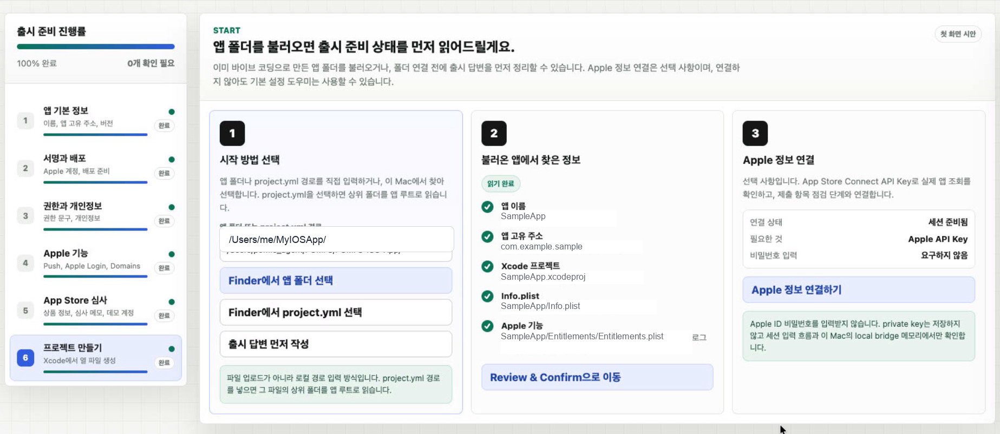

# iOS Release Assistant

**iOS Release Assistant**는 iOS 앱 출시 준비를 처음 하는 사람도 단계별로 따라갈 수 있게 만든 오픈소스 어시스턴트입니다. Xcode, XcodeGen, 서명, 권한, App Store Connect, 심사 정보, 스크린샷, 프로젝트 생성 과정을 한 화면에서 차례대로 확인하도록 도와줍니다.

이 도구는 **P.O.MFS Dev Team**에서 만들었습니다. 목표는 iOS 앱을 출시하려는 초보 개발자가 “다음에 무엇을 해야 하는지”를 몰라서 막히지 않게 하는 것입니다.

Xcode 프로젝트 생성을 명확하고 반복 가능하게 만든 **XcodeGen**에서 영감을 받았습니다. iOS Release Assistant는 XcodeGen을 대체하지 않고, 출시 준비 질문과 안전 확인을 거친 뒤 필요할 때 `xcodegen generate`를 실행하도록 돕습니다.

English guide is available below: [English](#english).

Repository: [github.com/pomfs-dev/ios-release-assistant](https://github.com/pomfs-dev/ios-release-assistant)

<p align="center">
  
</p>

## 왜 필요한가요?

iOS 앱 출시 준비는 앱을 만드는 것만큼 복잡할 수 있습니다.

- Xcode 서명, Bundle ID, 버전 번호를 놓치기 쉽습니다.
- `Info.plist`, Entitlements, 앱 아이콘, 스크린샷, 개인정보 처리방침, 심사 메모가 서로 다른 곳에 있습니다.
- App Store Connect와 Xcode의 용어가 다릅니다.
- 초보자는 언제 다음 단계로 넘어가야 하는지, 언제 백업을 만들어야 하는지, 언제 Xcode 프로젝트를 생성해야 하는지 알기 어렵습니다.

iOS Release Assistant는 이 과정을 질문형 플로우로 바꾸고, 실제 파일을 바꾸기 전에 **Review & Confirm** 단계에서 다시 확인하게 합니다.

## 주요 기능

- iOS 앱 폴더, XcodeGen `project.yml`, `.xcodeproj`, `.xcworkspace`, `Info.plist`, Entitlements, 앱 아이콘, Asset Catalog를 스캔합니다.
- 출시 준비 항목을 쉬운 질문으로 바꿔 보여줍니다.
- Xcode Archive 전에 빠진 항목이나 위험한 설정을 알려줍니다.
- App Store Connect API Key로 실제 앱 조회와 제한적인 초안 메타데이터 업데이트를 지원합니다.
- 파일을 바꾸기 전에 쓰기 계획을 먼저 만듭니다.
- 저장 전에 로컬 백업을 만듭니다.
- 사용자가 명시적으로 승인한 뒤에만 `xcodegen generate`를 실행합니다.
- App Store Connect private key는 메모리에서만 사용하고 프로젝트 파일에 저장하지 않습니다.

## 기술 구성

iOS Release Assistant는 iOS 앱 자체가 아니라, iOS 앱 출시 준비를 돕는 웹/로컬 도구입니다. 그래서 GitHub Languages에는 Swift가 아니라 이 도구를 구성하는 웹·로컬 브리지 코드가 표시됩니다.

- TypeScript, React, Vite 기반 UI
- 로컬 파일 접근과 XcodeGen 실행을 위한 Node.js local bridge
- CSS 기반 인터페이스 스타일
- Vite 기본 HTML 엔트리

GitHub Languages 비율은 추적 중인 코드의 바이트 수 기준으로 계산되므로, TypeScript와 JavaScript 비율이 높게 보이는 것이 정상입니다.

## 현재 제한사항

- Apple 공식 도구가 아닙니다.
- Apple ID 비밀번호를 묻거나 저장하지 않습니다.
- Xcode Archive나 App Store Connect 심사 제출을 대신하지 않습니다.
- 스크린샷 업로드, 앱 미리보기 영상 업로드, 전체 App Store Connect 메타데이터 제출은 아직 구현되어 있지 않습니다.
- 생성된 변경사항은 Xcode에서 열기 전에 반드시 직접 확인해야 합니다.

## 필요 환경

- macOS
- Node.js 20 이상
- npm
- Archive를 만들려면 Xcode
- `project.yml` 기반 프로젝트라면 XcodeGen

XcodeGen 설치:

```bash
brew install xcodegen
```

## 시작 전에 준비할 것

Assistant를 열기 전에 아래 값을 미리 준비해두면 훨씬 빠르게 진행할 수 있습니다.

### 1. App Store Connect 연결 정보

실제 App Store Connect 앱 세션을 확인하기 위해 사용할 API Key 정보를 준비합니다.

- Issuer ID
- Key ID
- `.p8` private key 본문
- App Apple ID: App Store Connect에 표시되는 숫자 앱 ID
- Bundle ID: 예를 들어 `com.example.myapp`

앱을 찾을 때는 보통 App Apple ID 또는 Bundle ID 중 하나만 있어도 되지만, 둘 다 준비해두면 혼동이 줄어듭니다. `.p8` key는 App Store Connect에서 key를 만들 때 한 번만 다운로드할 수 있으므로 저장소 밖의 안전한 위치에 보관하세요.

Apple ID 비밀번호는 준비하거나 입력하지 마세요. 이 도구는 Apple ID 로그인이 아니라 App Store Connect API Key를 사용합니다.

### 2. 앱 심사 정보

심사 제출 전에 심사자가 필요로 하는 정보를 준비합니다.

- 개인정보처리방침 URL: 로그인 없이 열리는 공개 `https://` 페이지
- App Store에 보일 앱 설명: 앱이 무엇을 하는지, 누구를 위한 앱인지 알 수 있는 설명
- 로그인 기능이 있는 경우 심사용 데모 계정: 이메일/아이디, 비밀번호, 주요 화면에 도달하기 위한 짧은 안내

로그인이 필요한 앱이라면 데모 계정을 production 또는 review 환경에 미리 만들어두고, 2단계 인증 없이 로그인 가능하며, 심사가 끝날 때까지 유지되도록 해야 합니다.

준비하면 좋은 선택 항목:

- 지원 URL
- 마케팅 URL
- App Review 연락처 이메일 또는 전화번호
- Apple 요구 규격에 맞춘 App Store 스크린샷
- 업데이트인 경우 "What's New" 문구

## 빠른 시작

```bash
git clone https://github.com/pomfs-dev/ios-release-assistant.git
cd ios-release-assistant
npm install
npm run dev
```

기본 로컬 주소는 `http://127.0.0.1:56604`입니다.

다른 포트로 실행:

```bash
npm run dev -- --port 56474
```

기본 앱 경로를 지정하고 싶다면:

```bash
cp .env.example .env
```

`.env` 파일에 다음처럼 입력합니다.

```bash
VITE_DEFAULT_APP_PATH=/Users/me/MyIOSApp
```

## 기본 사용 순서

1. 브라우저에서 로컬 Assistant를 엽니다.
2. iOS 앱 폴더 또는 XcodeGen `project.yml`을 선택합니다.
3. 단계별 질문을 차례대로 진행합니다.
4. 이해하고 확인할 수 있는 값만 입력합니다.
5. 오른쪽 체크리스트에서 빠진 항목을 처리합니다.
6. 마지막 Generate 단계에서 **Review & Confirm**을 엽니다.
7. 쓰기 계획을 만들고, 백업을 만든 뒤, 저장을 적용하고, Xcode 프로젝트를 생성합니다.
8. 생성된 `.xcodeproj`를 Xcode에서 엽니다.
9. Xcode에서 Product > Archive를 진행합니다.

## Review & Confirm: 정확한 버튼 순서

마지막 Review & Confirm 영역은 일부러 엄격하게 만들어져 있습니다. 프로젝트 파일을 실수로 덮어쓰지 않도록 하기 위한 안전장치입니다.

아래 순서대로 진행하세요.

1. 마지막 Generate 단계에서 **Review & Confirm 열기**를 누릅니다.
2. **쓰기 계획 만들기**를 누릅니다.
3. 변경될 파일과 예정 값을 모두 확인합니다.
4. **변경 예정 파일과 값을 확인했습니다.** 체크박스를 선택합니다.
5. **백업 만들기**를 누릅니다.
6. 백업 ID와 저장 대상 파일을 확인합니다.
7. **백업 ID와 저장 대상을 확인했습니다.** 체크박스를 선택합니다.
8. **저장 적용**을 누릅니다.
9. 저장 후 재스캔 검증이 끝날 때까지 기다립니다.
10. **xcodegen generate 실행과 기존 Xcode 프로젝트 백업을 승인합니다.** 체크박스를 선택합니다.
11. **Xcode 프로젝트 생성**을 누릅니다.
12. 생성된 `.xcodeproj`를 Xcode에서 열고 Product > Archive를 진행합니다.

버튼이 비활성화되어 있다면 바로 이전 체크박스나 단계가 아직 완료되지 않은 것입니다.

## App Store Connect API Key 사용

App Store Connect 단계에서는 실제 앱이 있는지 확인하고 제한적인 초안 메타데이터 업데이트를 준비할 수 있습니다.

필요한 값:

- Issuer ID
- Key ID
- App Apple ID 또는 Bundle ID
- `.p8` private key 본문

보안 규칙:

- `.p8` 파일을 Git에 커밋하지 마세요.
- Apple ID 비밀번호를 입력하지 마세요.
- 필요한 최소 권한의 App Store Connect API Key를 사용하세요.
- private key 입력값은 현재 로컬 세션에서만 사용해야 하며 프로젝트에 저장하면 안 됩니다.

## 개발

```bash
npm install
npm run dev
npm test
npm run build
```

기여 전 점검과 커밋 위생 안내는 [CONTRIBUTING.md](CONTRIBUTING.md)를 참고하세요.

## 만든 사람

iOS Release Assistant는 **P.O.MFS Dev Team의 David Kwon**이 만들었습니다.

P.O.MFS Dev Team은 AI 오케스트레이션, 자동화 파이프라인, 웹/앱/백엔드 제품 개발, 마케팅 테크를 결합해 P.O.MFS 플랫폼과 글로벌 아티스트 성장 시스템을 만드는 팀입니다.

이 프로젝트는 XcodeGen의 선언적이고 검토 가능한 프로젝트 생성 방식에서 영감을 받았습니다. 같은 정신을 App Store 출시 준비 플로우에 적용해, 초보자도 질문, 점검, 백업, 승인 순서로 안전하게 진행할 수 있도록 만들었습니다.

공식 홈페이지: [prideofmisfits.com](https://www.prideofmisfits.com)

## 라이선스

MIT License. 자세한 내용은 [LICENSE](LICENSE)를 참고하세요.

---

## English

**iOS Release Assistant** is an open-source, beginner-friendly release preparation tool for iOS apps. It turns the confusing parts of Xcode, XcodeGen, signing, entitlements, App Store Connect, review notes, screenshots, and final project generation into a step-by-step assistant.

Made by **P.O.MFS Dev Team** for developers who want to ship an iOS app without guessing which App Store release checklist item comes next.

It is inspired by **XcodeGen**, which made Xcode project generation explicit, repeatable, and reviewable. iOS Release Assistant does not replace XcodeGen; it guides release questions and safety checks, then helps run `xcodegen generate` only when the user explicitly approves it.


Repository: [github.com/pomfs-dev/ios-release-assistant](https://github.com/pomfs-dev/ios-release-assistant)

## Why This Exists

Preparing an iOS app for App Store release is often harder than writing the first version of the app:

- Xcode signing and bundle settings are easy to miss.
- `Info.plist`, entitlements, app icons, screenshots, privacy URLs, and review notes all live in different places.
- App Store Connect uses different wording from Xcode.
- Beginners often do not know whether they should click "Next", make a backup, generate a project, or open Xcode.

iOS Release Assistant gives you a guided workflow and a final Review & Confirm gate before files are changed.

## What It Does

- Scans an iOS app folder, XcodeGen `project.yml`, `.xcodeproj`, `.xcworkspace`, `Info.plist`, entitlements, app icons, and asset catalogs.
- Converts release setup into plain-language questions.
- Detects missing or risky release settings before Xcode Archive.
- Connects to App Store Connect with API keys for app lookup and limited draft metadata updates.
- Builds a write plan before touching files.
- Creates local backups before safe writes.
- Runs `xcodegen generate` only after explicit confirmation.
- Keeps App Store Connect private keys in memory only; they are not written into the project.

## Technology Stack

iOS Release Assistant is not an iOS app codebase. It is a web and local assistant for preparing iOS app releases, so GitHub Languages shows the tool's web UI and local bridge code instead of Swift.

- TypeScript, React, and Vite for the UI
- A local Node.js bridge for file access and XcodeGen execution
- CSS for interface styling
- A Vite HTML entry point

GitHub Languages is calculated from tracked source-code bytes, so it is expected to see TypeScript and JavaScript as the dominant languages.

## Current Limits

- This is not an official Apple tool.
- It does not ask for, store, or need an Apple ID password.
- It does not replace Xcode Archive or App Store Connect review submission.
- Screenshot upload, app preview upload, and full App Store Connect metadata submission are not implemented yet.
- You should still review every generated change before opening Xcode.

## Requirements

- macOS
- Node.js 20 or newer
- npm
- Xcode, if you want to archive or open the generated project
- XcodeGen, if your project uses `project.yml`

Install XcodeGen if needed:

```bash
brew install xcodegen
```

## Prepare Before You Start

You can move through the Assistant much faster if you prepare these values before opening it.

### 1. App Store Connect connection

Prepare the App Store Connect API key information used to verify the real app session:

- Issuer ID
- Key ID
- `.p8` private key text
- App Apple ID, the numeric app ID shown in App Store Connect
- Bundle ID, for example `com.example.myapp`

You normally need either the App Apple ID or the Bundle ID to find the app, but keeping both ready avoids confusion. The `.p8` key can only be downloaded from App Store Connect when the key is created, so store it securely outside the repository.

Do not prepare or enter an Apple ID password. This tool uses App Store Connect API keys, not Apple ID login credentials.

### 2. App Review information

Prepare the information reviewers will need before you submit the app:

- Privacy Policy URL: a public `https://` page that opens without login.
- App Store description: a clear explanation of what the app does and who it is for.
- Demo account, if the app requires login: email/username, password, and any short notes reviewers need to reach the main screens.

For login-required apps, make sure the demo account is already created in your production or review environment, does not require two-factor authentication, and remains available during the full review period.

Useful optional items:

- Support URL
- Marketing URL
- Contact email or phone number for App Review
- App Store screenshots prepared in Apple's required sizes
- Short "What's New" text for updates

## Quick Start

```bash
git clone https://github.com/pomfs-dev/ios-release-assistant.git
cd ios-release-assistant
npm install
npm run dev
```

The local server runs on `http://127.0.0.1:56604` by default.

To choose a different port:

```bash
npm run dev -- --port 56474
```

Optional local default app path:

```bash
cp .env.example .env
```

Then edit `.env`:

```bash
VITE_DEFAULT_APP_PATH=/Users/me/MyIOSApp
```

## Basic Workflow

1. Open the local Assistant in your browser.
2. Select your iOS app folder or XcodeGen `project.yml`.
3. Go through the setup steps one by one.
4. Fill in only values you understand and can verify.
5. Use the right-side checklist to resolve missing items.
6. On the final Generate step, open **Review & Confirm**.
7. Build the write plan, create a backup, apply the changes, and generate the Xcode project.
8. Open the generated project in Xcode.
9. Archive and upload through Xcode Organizer.

## Review & Confirm: Exact Button Order

The final Review & Confirm area is intentionally strict. It is designed to make sure you do not overwrite project files by accident. The current UI uses Korean labels, so the exact button text is shown below with English meaning in parentheses.

Use this order:

1. Click **Review & Confirm 열기** (Open Review & Confirm) from the final Generate step.
2. Click **쓰기 계획 만들기** (Create Write Plan).
3. Review every file operation and proposed value.
4. Check **변경 예정 파일과 값을 확인했습니다.** (I reviewed the files and values that will change).
5. Click **백업 만들기** (Create Backup).
6. Confirm the backup ID and target files.
7. Check **백업 ID와 저장 대상을 확인했습니다.** (I reviewed the backup ID and write targets).
8. Click **저장 적용** (Apply Save).
9. Wait for the post-write scan verification.
10. Check **xcodegen generate 실행과 기존 Xcode 프로젝트 백업을 승인합니다.** (I approve running xcodegen generate and backing up the existing Xcode project).
11. Click **Xcode 프로젝트 생성** (Generate Xcode Project).
12. Open the generated `.xcodeproj` in Xcode and continue with Product > Archive.

If a button is disabled, the previous checkbox or step has not been completed yet.

## App Store Connect API Keys

The App Store Connect step can verify that the app exists and can prepare limited metadata updates.

Use:

- Issuer ID
- Key ID
- App Apple ID or Bundle ID
- `.p8` private key text

Security rules:

- Do not commit `.p8` files.
- Do not paste Apple ID passwords.
- Use the minimum App Store Connect API key permissions needed for the task.
- Private key input is used for the current local session and should not be saved in your project.

## Development

```bash
npm install
npm run dev
npm test
npm run build
```

For contribution checks and commit hygiene, see [CONTRIBUTING.md](CONTRIBUTING.md).

## Creator

iOS Release Assistant was created by **David Kwon of P.O.MFS Dev Team**.

P.O.MFS Dev Team builds the P.O.MFS platform and global artist growth systems by combining AI orchestration, automation pipelines, web/app/backend product development, and marketing technology.

The project is inspired by XcodeGen's declarative and reviewable project-generation model. It applies the same spirit to App Store release preparation so beginners can move through questions, checks, backups, and approvals safely.

Official website: [prideofmisfits.com](https://www.prideofmisfits.com)

## License

MIT License. See [LICENSE](LICENSE).
